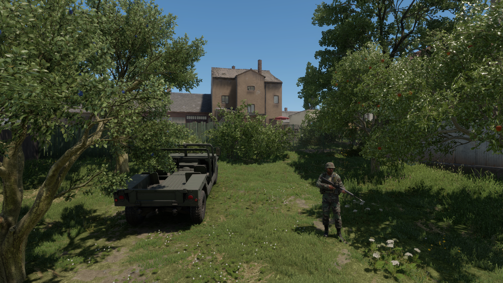
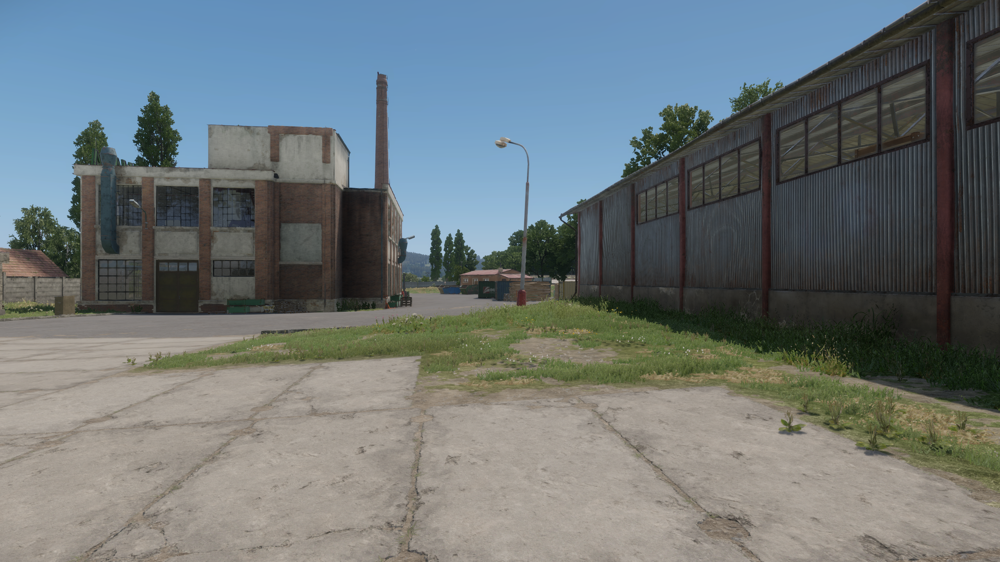
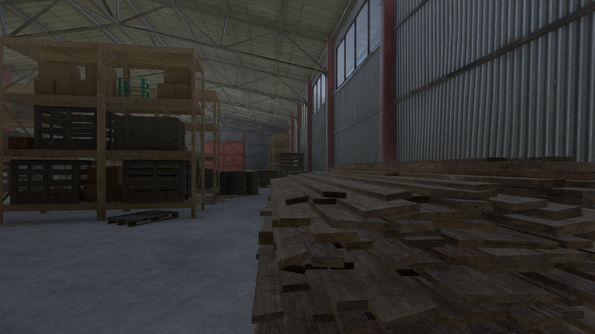
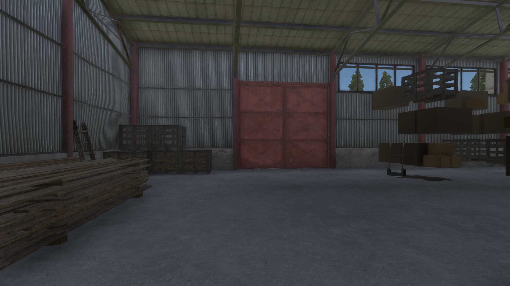
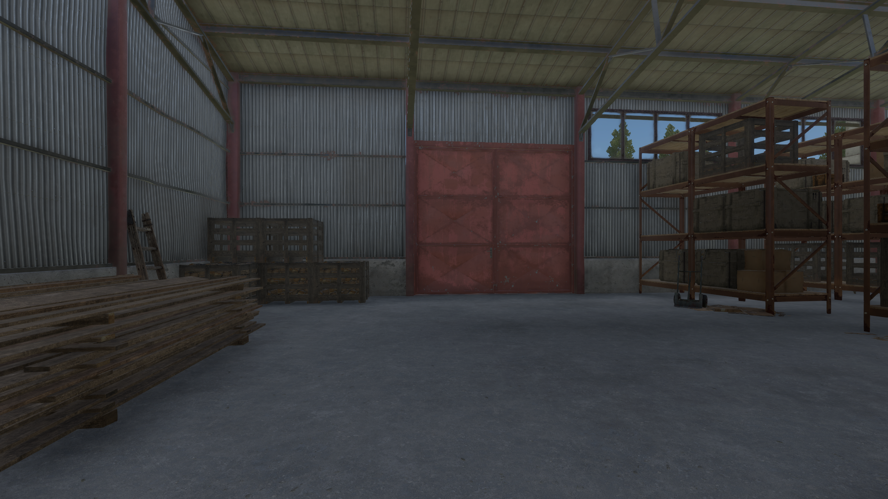
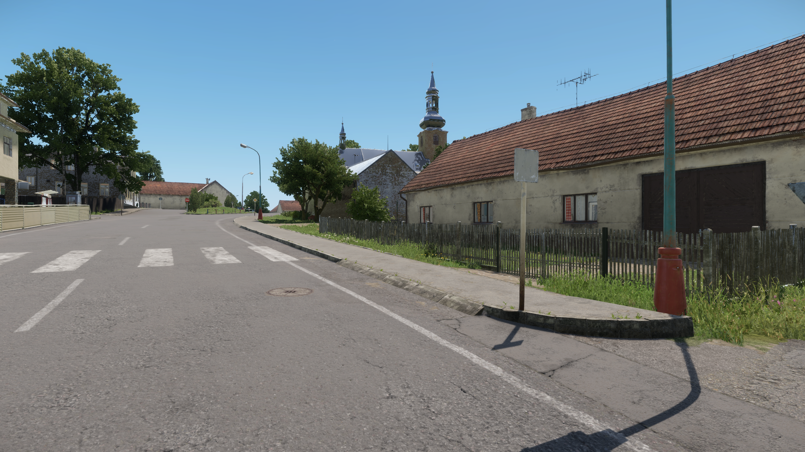
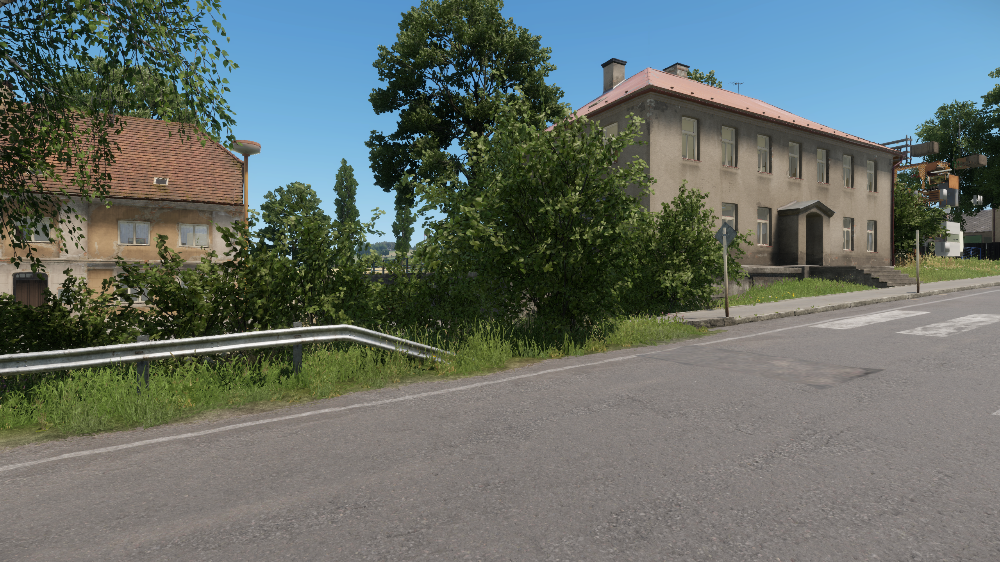
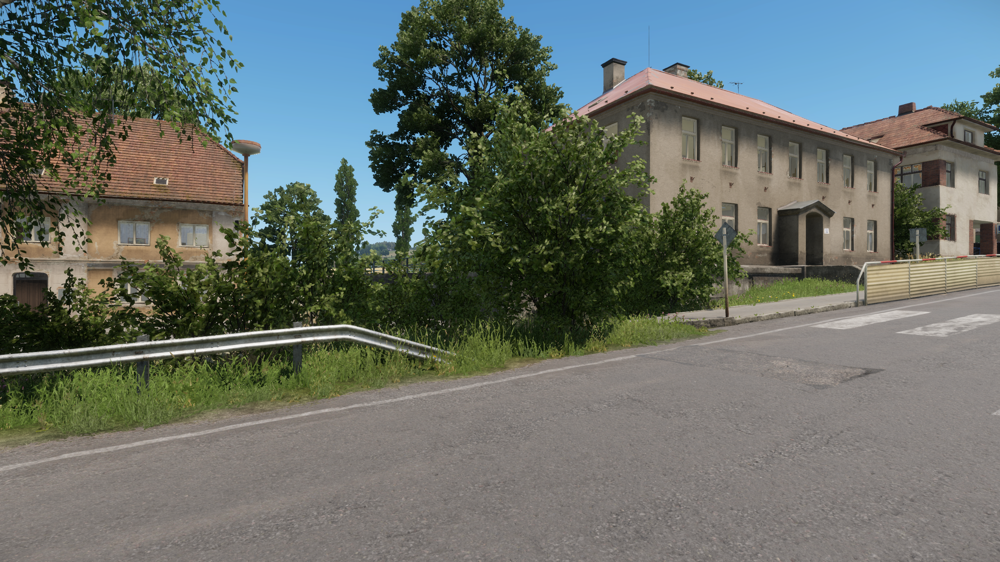

# Arma scenes

These captures begin the real-environment test set. They are unprocessed Enfusion images; no lighting model or aligned reference has been applied.

<figure><a href="media/arma-st-philippe-entities.png"></a><figcaption>Saint-Philippe · source capture with a placed vehicle and character</figcaption></figure>

The isolated simulation loads Everon using a resource name observed by the native inventory. Camera position, projection, exposure, date, weather, wind and output dimensions pass the capture checks. Internal viewport scale, FSR and presentation frame identity remain unverified. The full-resolution PNG is unchanged from the captured file.

| Coverage | State |
| --- | --- |
| Garden, vegetation, fences and building exteriors | Captured and visually inspected |
| Upright vehicle and standing character | Captured and visually inspected |
| Factory yard, warehouse exteriors and industrial structures | Four views captured and inspected |
| Warehouse interior and stored objects | Longer camera hold restores shelving detail in three runs; earlier failures retained |
| Montignac town streets, crossings and building facades | Longer camera hold restores building and sign detail in three runs; earlier failures retained |
| Neural fidelity on Arma scenes | Untested |
| Supported engine inputs and output | Unproven |

The first entity attempt placed both prefabs underground because the editor terrain query returned zero during simulation. Switching to the simulation world's surface query corrected height, but an XYZ rotation then overturned the vehicle. The final run sets an upright spawn matrix before creation. Both failed attempts remain in [the evidence](https://github.com/ethan03805/enfusion-neural/blob/main/evidence/enfusion-arma-scenes-v1.json), alongside the successful capture and its exact script/config hashes. A successful screenshot alone never establishes correct entity placement.

<figure><a href="media/arma-factory-yard.png"></a><figcaption>Saint-Philippe factory · unprocessed source view</figcaption></figure>

The factory scout records four directions from one camera position. The first faces a nearby container; the others show the yard, industrial buildings and warehouse facade. All four views were inspected and retain their hashes and camera records. Sample 2 was chosen afterward to illustrate the complex; no model output was selected or evaluated. The [factory config](https://github.com/ethan03805/enfusion-neural/blob/main/scenes/arma-factory-v1.json) reproduces the four views.

<figure><a href="media/arma-warehouse-interior.png"></a><figcaption>Warehouse interior · unprocessed source view</figcaption></figure>

Four [interior views](https://github.com/ethan03805/enfusion-neural/blob/main/scenes/arma-warehouse-interior-v1.json) include shadowed timber, crates, shelving and high windows. The original short-hold capture above has incomplete detail. In the comparison below, holding each camera direction for 120 simulation updates restores the missing shelf supports. Both sides are independent, unprocessed engine captures at the same camera position and direction.

<section class="comparison" data-comparison data-before-label="6-update source" data-after-label="120-update source" aria-label="Warehouse camera settling comparison">
<div class="comparison-images">
<figure class="comparison-before"><figcaption>6 updates · original source</figcaption></figure>
<figure class="comparison-after"><figcaption>120 updates · source</figcaption></figure>
<span class="comparison-divider" aria-hidden="true"></span>
</div>
<label class="comparison-control" hidden>Reveal short-hold source<input type="range" min="0" max="100" value="50" aria-label="Short-hold source visible"><output>50% 6-update source</output></label>
</section>

[Open original source](media/arma-warehouse-source-anomaly.png) · [Open longer-hold source](media/arma-warehouse-settled.png)

<figure><a href="media/arma-montignac-street.png"></a><figcaption>Montignac · unprocessed street view</figcaption></figure>

The four [Montignac views](https://github.com/ethan03805/enfusion-neural/blob/main/scenes/arma-montignac-v1.json) add streets, crossing markings, houses and outdoor furniture. The original street view above also has incomplete surface detail. In sample 1 below, the longer hold restores the building shell and barrier at the right edge. It also restores the crossing-sign artwork and pub chalkboard writing in the other inspected directions.

<section class="comparison" data-comparison data-before-label="6-update source" data-after-label="120-update source" aria-label="Montignac camera settling comparison">
<div class="comparison-images">
<figure class="comparison-before"><figcaption>6 updates · original source</figcaption></figure>
<figure class="comparison-after"><figcaption>120 updates · source</figcaption></figure>
<span class="comparison-divider" aria-hidden="true"></span>
</div>
<label class="comparison-control" hidden>Reveal short-hold source<input type="range" min="0" max="100" value="50" aria-label="Short-hold source visible"><output>50% 6-update source</output></label>
</section>

[Open original source](media/arma-montignac-source-anomaly.png) · [Open longer-hold source](media/arma-montignac-settled.png)

## Capture settling

Ten isolated runs compare a fresh repeat, a longer startup wait and a longer hold after each camera turn. The initial six runs change one control at a time. After inspecting those results, two further long-hold runs per scene check whether the restored detail persists. All 40 new views were inspected; the eight original views and every failure remain in the evidence.

| Control | Startup wait | Hold per view | Result in both scenes |
| --- | --- | --- | --- |
| Fresh repeat | 8 seconds | 6 updates | Incomplete structure or surface detail persists |
| Longer startup wait | 30 seconds | 6 updates | Incomplete detail persists |
| Longer camera hold, three runs | 8 seconds | 120 updates | Observed supports, building surfaces and markings remain visible |

This supports a 120-update hold for these two offline fixtures. It does not establish the precise streaming, level-of-detail or visibility mechanism, or guarantee that every asset has settled. The updates are simulation callbacks, not a verified GPU completion fence. Simulation and foliage continue between captures, so the images are not pixel-identical and are not aligned appearance-training pairs.

Against the first long-hold run, the two follow-up runs have per-view RGB mean absolute differences of 0.0021–0.0160 code values in the warehouse and 0.1451–2.0184 in Montignac. Those values measure source variation, not neural quality. Each successive sample is exactly 120 logged world updates later, spanning 1.216–1.866 simulation seconds across the six long-hold runs; this is not a playback or rendering frame rate.

The comparisons use the original anomaly and sample 1 from the first long-hold run, with no cropping, retouching, color adjustment or neural processing. All images retain their original 2560 × 1440 bytes. [Full capture and difference report](https://github.com/ethan03805/enfusion-neural/blob/main/evidence/enfusion-source-visibility-v1.json) · [Per-frame observations](https://github.com/ethan03805/enfusion-neural/blob/main/evidence/enfusion-source-visibility-review-v1.json) · [Initial control plan](https://github.com/ethan03805/enfusion-neural/blob/main/scenes/arma-source-visibility-v1.json) · [Follow-up repeat plan](https://github.com/ethan03805/enfusion-neural/blob/main/scenes/arma-source-visibility-repeats-v1.json).

Next, use this hold as a starting point for short camera paths through the town, factory and interior, plus controlled vehicle/character motion. Verify every new view before introducing model outputs. [Supported integration](integration.md) and aligned lighting references remain separate requirements.

Reproduce the source view with the [versioned camera config](https://github.com/ethan03805/enfusion-neural/blob/main/scenes/arma-st-philippe-v1.json) and a completed [native world inventory](integration.md#inventory-without-a-world):

```powershell
python scripts/capture_enfusion_scout.py --out experiments/local/st-philippe-recheck --config scenes/arma-st-philippe-v1.json --world-inventory experiments/local/resource-inventory-module-v2/resources.json --entities --lab-source <enfusion-lab-root>
```

Each run uses a new isolated addon. Inspect its images before accepting the scene. Entity physics and foliage continue during capture; this is not a deterministic animation fixture or a real-time performance measurement.

To reproduce one visibility control, choose a new output folder and set `--scene` to `warehouse` or `montignac`, and `--condition` to `repeat`, `initial-settle` or `camera-hold`:

```powershell
python scripts/probe_enfusion_source_visibility.py --out experiments/local/visibility-recheck --scene warehouse --condition camera-hold --world-inventory experiments/local/resource-inventory-module-v2/resources.json --lab-source <enfusion-lab-root>
```

Arma Reforger imagery © Bohemia Interactive a.s.; it is outside this repository's code license. [Game-content usage rules](https://www.bohemia.net/en/community/game-content-usage-rules).
