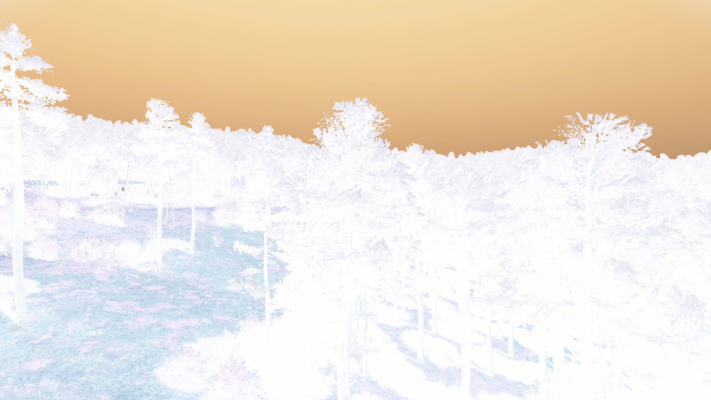
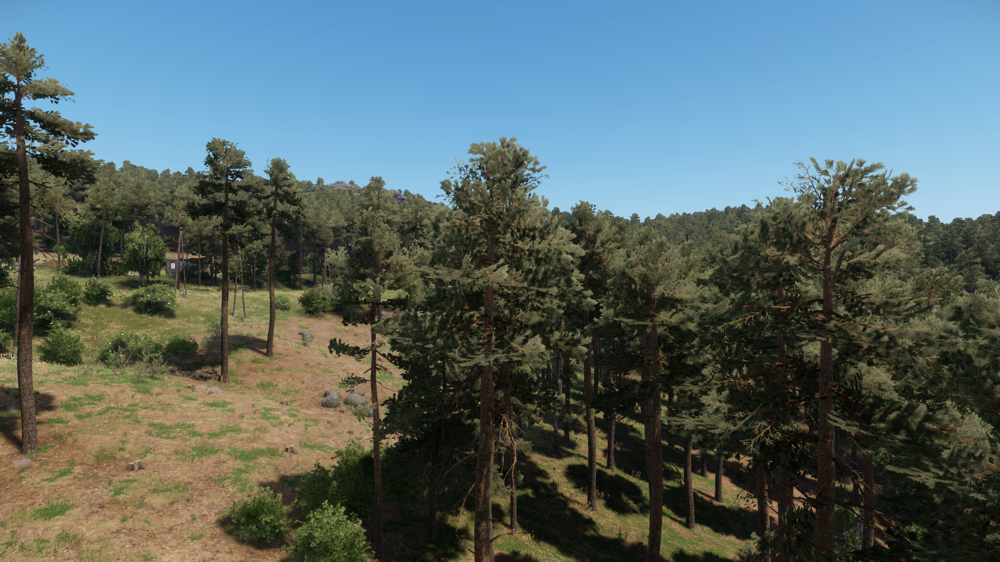

# Color lookup

An original color lookup now visibly changes the Enfusion camera output through its documented post-processing interface. All three lookup textures retain their exact original pixels after native import. Correct display-color mapping remains unverified; this experiment runs no neural model.

<section class="comparison" data-comparison data-before-label="Off" data-after-label="Inversion lookup" aria-label="Off and inversion lookup">

<figure class="comparison-before"><figcaption>Off</figcaption></figure>
<figure class="comparison-after"><figcaption>Inversion lookup</figcaption></figure>

<label class="comparison-control" hidden>Reveal off<input type="range" min="0" max="100" value="50" aria-label="Off visible"><output>50% Off</output></label>
</section>

Both images are unchanged 2560 × 1440 engine exports from separate runs. The color change is a diagnostic. It is not an enhancement or a reconstruction of missing lighting.

## What worked

Native schema inspection finds `Enabled` and the texture field `ColorTable` on `ColorGradingEffect`. Three original 256 × 16 images encode 16³ identity, inversion and constant-color volumes. The import uses `VolumeTexture 1`, no mipmaps and the recorded `ToLinear` color-space setting. An independent decoder verifies every compiled RGBA voxel, including axis order and alpha. This proves the stored lattice; shader sampling remains a separate question.

The first effect request fails explicitly: priority 1000 exceeds the engine's reported maximum of 19. The original plan and both initial captures remain unchanged. A separately committed follow-up uses priority 19 and checks the complete native texture readback, including its trailing `0` field. All seven follow-up captures pass compilation, camera/projection, material-readback and request checks.

The constant lookup stores `[51, 102, 204]`. Every exported pixel is **[123, 169, 231]**. This establishes visible application and rejects a direct RGB8-to-RGB8 interpretation. A transfer after lookup sampling is a plausible explanation, still to be tested with independent colors. One observation cannot identify the transfer or placement relative to tone mapping.

## Numerical controls

The original plan characterizes errors without fitting a color curve. Its only response threshold requires the constant effect to change the first baseline by at least 5 RGB8 MAE; that check passes. No reserved color-accuracy gate was declared for this batch.

| Engine capture | CPU display hypothesis | RGB8 MAE | Maximum channel error |
| --- | --- | ---: | ---: |
| Identity lookup | Unchanged first baseline | 1.286 | 182 |
| Inversion lookup | 255 minus first baseline | 69.798 | 215 |
| Constant lookup | [51, 102, 204] everywhere | 55.333 | 72 |
| Apply then remove | Unchanged first baseline | 0.474 | 162 |

None matches exactly. Three independent off captures have pairwise MAE **0.561–2.475**, with maximum channel difference **194**. Identity and removal errors are below the largest off-repeat MAE, but this does not establish equivalence: scene variation can obscure a small effect error. The raw differences and all repeat pairs remain in the evidence.

<section class="comparison" data-comparison data-before-label="Identity lookup" data-after-label="Removed" aria-label="Identity lookup and removed effect">

<figure class="comparison-before"><figcaption>Identity lookup</figcaption></figure>
<figure class="comparison-after"><figcaption>Removed</figcaption></figure>

<label class="comparison-control" hidden>Reveal identity lookup<input type="range" min="0" max="100" value="50" aria-label="Identity lookup visible"><output>50% Identity lookup</output></label>
</section>

Removal occurs immediately after application, before settling. This is not a test of switching during motion. HUD, scopes, exposure transitions, another resolution, runtime packaging and complete-frame cost are untested. A lookup cannot provide depth, normals or material data, or execute the full scene-conditioned lighting model.

## Reproduce and continue

Use `scripts/probe_enfusion_material_schema.py` with the schema plan and a verified native resource inventory. Build the original controls with `scripts/build_enfusion_color_lookup.py`, then run `scripts/capture_enfusion_color_lookup.py --priority-followup` for off, identity, inversion, constant, removed, off and off, each in a fresh output directory. Run `--help` for required paths. Keep GPU runs serial. The summarizer requires the native build/schema/inventory records and full-size review of all nine retained captures.

Next, declare independent constant colors and ramps to distinguish transfer and lookup-sampling hypotheses. Freeze numerical limits before reserved controls. Then test activation/removal during motion, camera cuts, exposure changes and a second resolution. The full lighting model still needs a supported scene-input and execution interface, followed by actual Arma model/reference comparisons and complete-frame timing.

[Off](media/color-lookup-off.png) · [Identity](media/color-lookup-identity.png) · [Inversion](media/color-lookup-inversion.png) · [Constant](media/color-lookup-constant.png) · [Removed](media/color-lookup-removed.png) · [Off repeat 2](media/color-lookup-off-repeat2.png) · [Off repeat 3](media/color-lookup-off-repeat3.png)

[Initial baseline](media/color-lookup-initial-off.png) · [Rejected priority control](media/color-lookup-rejected-identity.png)

[Measurements and provenance](https://github.com/ethan03805/enfusion-neural/blob/main/evidence/enfusion-color-lookup-v1.json) · [Full-size visual review](https://github.com/ethan03805/enfusion-neural/blob/main/evidence/enfusion-color-lookup-review-v1.json) · [Initial plan](https://github.com/ethan03805/enfusion-neural/blob/main/scenes/color-lookup-control-v1.json) · [Priority follow-up](https://github.com/ethan03805/enfusion-neural/blob/main/scenes/color-lookup-priority-v2.json)

Interface sources: [camera post-processing](https://community.bistudio.com/wikidata/external-data/arma-reforger/EnfusionScriptAPIPublic/interfaceBaseWorld.html), [effect types](https://community.bistudio.com/wikidata/external-data/arma-reforger/EnfusionScriptAPIPublic/group__World.html), [volume texture import](https://community.bistudio.com/wiki/Arma_Reforger:Textures#VolumeTexture). The narrow original-fixture decoder follows the [LZ4 block format](https://github.com/lz4/lz4/blob/dev/doc/lz4_Block_format.md); it is not a general game-asset decoder.

Game imagery belongs to Bohemia Interactive a.s. and is outside the MIT code license. All nine images were inspected at full resolution and copied without retouching. No game material or texture asset is redistributed.
