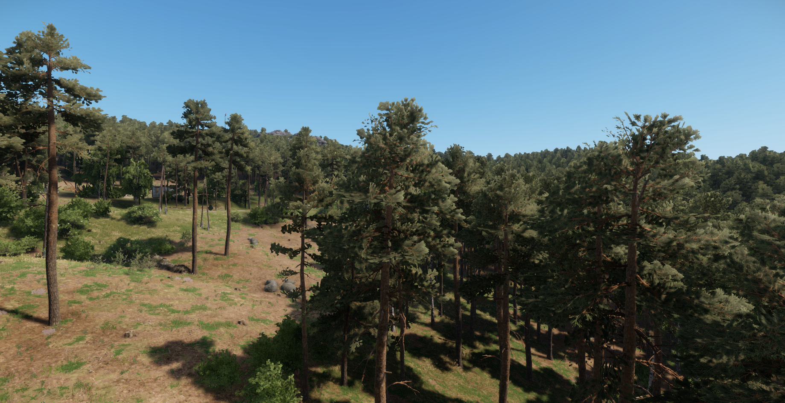
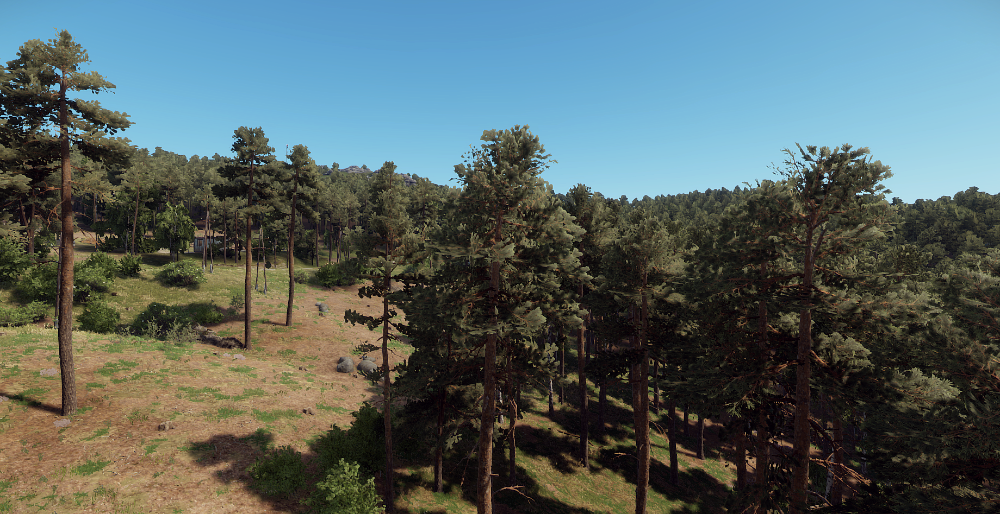
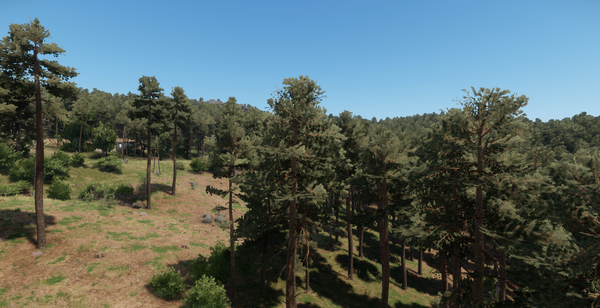
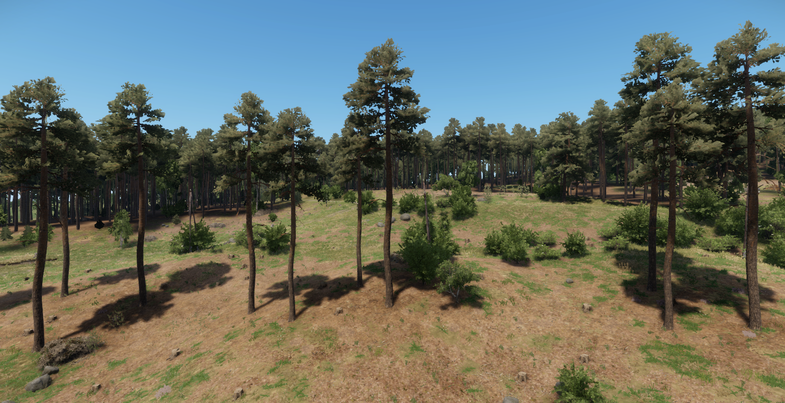
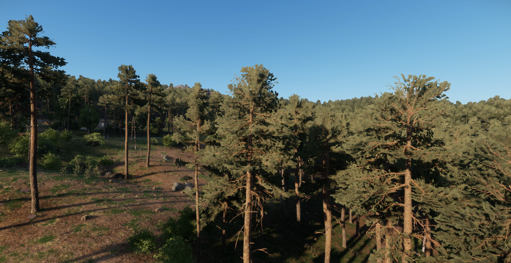

# Comparisons

The original Arland export and the same image processed by the v0 model. The output exaggerates foliage edges and dark boundaries. This is a recorded failure of the current appearance model.

<section class="comparison" data-comparison aria-label="Arland original and v0 model output">

<figure class="comparison-before"><figcaption>Before · Workbench capture</figcaption></figure>
<figure class="comparison-after"><figcaption>After · v0 model</figcaption></figure>

<label class="comparison-control" hidden>Reveal original<input type="range" min="0" max="100" value="50" aria-label="Original image visible"><output>50% original</output></label>
</section>

[Open original PNG](media/arland-before.png) · [Open model output PNG](media/arland-after.png)

Both PNGs retain their full 1839 × 947 resolution. The page scales them equally to fit the screen; open either file to inspect individual pixels. The slider reveals the original on the left and the model output on the right. Without JavaScript, both labeled images remain visible.

The output was produced by native D3D12 inference with the trained 251-parameter `bootstrap-v0` model. The original image is the model input, with no added degradation. Neither published image has been retouched, cropped, color-matched or recompressed. This is the existing benchmark pair from 8 September 2026, selected before adding this page.

Numerical CPU/GPU agreement passed, but the visible result does not meet the project's fidelity objective. There is no aligned photographic target for this scene, and this pair establishes neither photorealism nor live game performance. See the [measurement record](evidence.md#neural-gpu-execution) and [image provenance](media/manifest.json).

## Reference views

The [reference scene pack](reference-scenes.md) controls camera and environment settings. These are the first captures in run order from each of its three variants, all unprocessed. Changing the time of day is a scene variation, not a model improvement.

<figure class="scene-image"><figcaption>East · 13:00 · repeat 1</figcaption></figure>

<figure class="scene-image"><figcaption>North · 13:00 · repeat 1</figcaption></figure>

<figure class="scene-image"><figcaption>East · 18:30 · repeat 1</figcaption></figure>

## Motion

Left: Workbench capture. Right: the same frames processed by the v0 model.

<figure class="motion-comparison">
<video controls playsinline preload="none" poster="media/arland-motion-poster.png" width="3840" height="1080" aria-label="Synchronized Arland source and v0 model comparison"><source src="media/arland-motion.mp4" type="video/mp4"><a href="media/arland-motion.mp4">Download the comparison video</a></video>
<figcaption>80 paired frames · offline processing · four seconds at 20 FPS</figcaption>
</figure>

[Download MP4 · 34.5 MiB](media/arland-motion.mp4) · [Full-resolution first source frame](media/arland-motion-first.png) · [Full-resolution first model output](media/arland-motion-first-output.png)

The camera moves two metres and turns eight degrees along a fixed path. Each 2560 × 1440 source frame has exactly one GPU output, and every output passed the independent CPU comparison with at most one RGB code-value difference and exact alpha. The output still has exaggerated foliage boundaries; the clip does not demonstrate acceptable appearance quality.

Both sides are encoded in one stream to maintain synchronization. Each full frame is scaled equally to 1920 × 1080, then the pair is encoded at 3840 × 1080 using H.264, CRF 16 and 4:2:0 chroma. There are no interpolated or dropped samples. Video compression and scaling change pixels; use the PNG links for pixel inspection.

The source sequence spans 21.762 simulation seconds and is retimed to four seconds. This is not a real-time recording or a 20 FPS performance claim. Render scale and FSR in Workbench's actual viewport remain unverified. [Capture controls and reproduction](capture-controls.md) · [Complete frame records](https://github.com/ethan03805/enfusion-neural/blob/main/evidence/motion-v1.json).

For aligned lighting targets, see the separate [material room](material-room.md). Its path-traced references are synthetic targets, not outputs from this neural model.

Arma Reforger imagery © Bohemia Interactive a.s. This independent website is not affiliated with or authorized by Bohemia Interactive. Game names, designs and associated trademarks belong to their owners. Screenshots are shared under the [game content usage rules](https://www.bohemia.net/en/community/game-content-usage-rules); game imagery is outside this repository's MIT code license.
