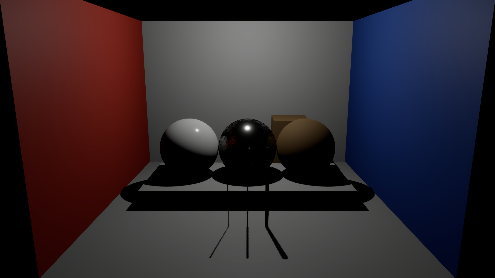
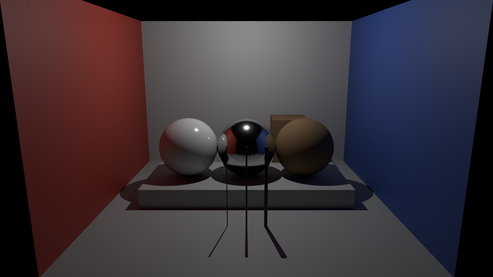
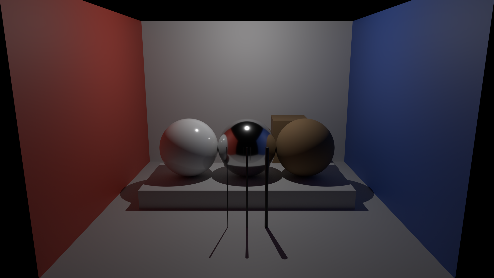

# Light calibration

The fixed brightness mapping **fails its reserved checks**. This experiment compares eight Enfusion captures with a separately rendered point-light fixture at 2560 × 1440. Seven of 22 reserved patch checks exceed their declared limits. None of these images has neural processing, and this is not an accepted appearance-training pair.

<section class="comparison" data-comparison data-before-label="Enfusion" data-after-label="One bounce" aria-label="Engine and one-bounce reference">
<div class="comparison-images">
<figure class="comparison-before"><figcaption>Enfusion</figcaption></figure>
<figure class="comparison-after"><figcaption>One bounce</figcaption></figure>
<span class="comparison-divider" aria-hidden="true"></span>
</div>
<label class="comparison-control" hidden>Reveal Enfusion<input type="range" min="0" max="100" value="50" aria-label="Enfusion visible"><output>50% Enfusion</output></label>
</section>

The reference uses the original room geometry and material definitions, with a point emitter at the corresponding position. It is a comparison fixture, not ground truth for the engine's current lighting. Material response, environment reflections, color transfer and internal render scale remain unresolved.

## Fixed mapping

The [plan](https://github.com/ethan03805/enfusion-neural/blob/main/scenes/point-light-calibration-v1.json) fixes camera exposure, midnight environment, materials and a requested clipping bias of −10. Captures follow the order off, LV 8, 10, 12, 9, 11, 10, 10. The first LV 10 image above was selected in the plan.

Only one neutral back-wall patch at LV 8, 10 and 12 fits the response. LV 9 and 11, plus four other patches at every intensity, are reserved. The [committed fit](https://github.com/ethan03805/enfusion-neural/blob/main/evidence/point-light-calibration-lock-v1.json) fixes two coefficients before those numerical checks:

```text
log2(gain) = 1.1417137977850145 × LV − 14.413323201493062
display = clipped standard sRGB(linear reference × gain)
```

There is no per-channel correction. All four displayed reference images use the same predicted LV 10 gain, **0.12533096255755358**, rounded to RGB8. No alignment, denoising or retouching is applied. Native LV is not assumed to be a physical light unit.

| Reserved region | Worst RGB8 MAE | Limit | Failed checks |
| --- | ---: | ---: | ---: |
| Fit back-wall patch at LV 9 and 11 | 10.51 | 5 | 1 / 2 |
| Separate back-wall patch | 9.04 | 10 | 0 / 5 |
| Floor | 29.95 | 10 | 1 / 5 |
| Red wall | 14.13 | 10 | 3 / 5 |
| Blue wall | 13.47 | 10 | 2 / 5 |

These are mean absolute errors over the declared pixels and RGB channels. All 25 measurements, including the three fitting-region diagnostics, remain in the evidence. The separate back-wall patch passes at every setting; that does not override the other failures. Whole-image MAE rises from **3.77 at LV 8** to **21.53 at LV 12**; the LV 10 value is **8.48**. Whole-image error has no acceptance threshold in this diagnostic.

## Light transport

Four Cycles renders use 4,096 samples each: one and twelve maximum bounces, each with seeds 17 and 29. The historical artifact name `direct` means the one-bounce role. It already includes indirect illumination and must not be interpreted as a direct-light-only pass.

<section class="comparison" data-comparison data-before-label="One bounce" data-after-label="Twelve bounces" aria-label="One and twelve bounce reference">
<div class="comparison-images">
<figure class="comparison-before"><figcaption>One bounce</figcaption></figure>
<figure class="comparison-after"><figcaption>Twelve bounces</figcaption></figure>
<span class="comparison-divider" aria-hidden="true"></span>
</div>
<label class="comparison-control" hidden>Reveal one bounce<input type="range" min="0" max="100" value="50" aria-label="One bounce visible"><output>50% One bounce</output></label>
</section>

Depth and object IDs match exactly between one- and twelve-bounce renders with the same seed. Every measurement patch belongs entirely to its declared object. Independent-seed relative error in the one-bounce patches ranges from **0.083% to 0.223%**, below the 1% limit. The fitting patch has no clipped pixels at the three fit settings. Those checks pass; the brightness-response check fails.

The displayed independent-seed whole-image MAE is **0.0477** for one bounce and **0.1184** for twelve bounces, with a maximum channel difference of 39 in each pair. Residual sampling variation remains. Neither a clean patch nor a static comparison establishes motion fidelity.

## Retained captures

All eight engine captures compile and export successfully. The five measurement patches are black with the light disabled, although a faint spot remains elsewhere. The three independent LV 10 images have whole-image MAE between **0.00000723 and 0.00021449**, with maximum channel difference **19**. None is exactly RGB-identical.

[Off](media/light-calibration-off.png) · [LV 8](media/light-calibration-lv8.png) · [LV 9](media/light-calibration-lv9.png) · [LV 10](media/light-calibration-lv10.png) · [LV 11](media/light-calibration-lv11.png) · [LV 12](media/light-calibration-lv12.png) · [LV 10 repeat 2](media/light-calibration-lv10-repeat2.png) · [LV 10 repeat 3](media/light-calibration-lv10-repeat3.png)

[One-bounce seed check](media/light-calibration-one-bounce-check.png) · [Twelve-bounce seed check](media/light-calibration-many-bounces-check.png)

The disabled native light reports radius −15 for a requested +15; that signed mismatch remains recorded. Intensity, color, attenuation and clipping values are requests without getter verification. Night environment and reflection probes remain active. Earlier normal/UV export precision failures are unchanged. Differences here cannot be attributed solely to exposure or missing indirect light.

## Continue

The next integration experiment should inspect the supported color-grading material schema, then test an original identity and known-color lookup texture with fixed camera/exposure controls. A working lookup effect would establish a limited color-output route. It would not supply the depth, normals and material data required by the full lighting model. See [integration](integration.md#color-lookup-control).

Before training on engine pairs, isolate environment/reflection contributions and verify the color/material response with a separately declared experiment. Keep this failed mapping, the original area-light fixture, locked models and acceptance limits intact.

To reproduce, start from the original import and packed-texture build in [material room](material-room.md). Add `--calibration-case CASE --texture-case packed` to `scripts/capture_enfusion_material_room.py` for each planned case in a new output directory. Use `scripts/render_point_light_reference.py` for the four references, and `scripts/lock_point_light_calibration.py` before evaluating reserved data. The analyzer requires that lock and all eight native visual reviews. The summarizer also requires full-size inspection of all raw and mapped reference PNGs. Run each script with `--help` for its required source and output paths.

[Measurements and provenance](https://github.com/ethan03805/enfusion-neural/blob/main/evidence/point-light-calibration-v1.json) · [Native visual review](https://github.com/ethan03805/enfusion-neural/blob/main/evidence/point-light-calibration-native-review-v1.json) · [Reference visual review](https://github.com/ethan03805/enfusion-neural/blob/main/evidence/point-light-calibration-reference-review-v1.json)
