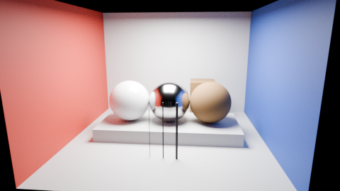
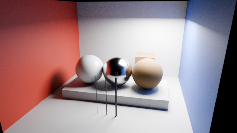
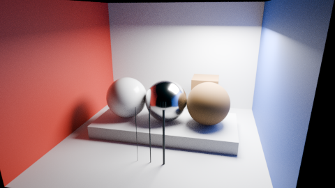

# Lighting reconstruction

A small model learns a missing diffuse-light contribution in the original material room. It receives the cheaper render together with surface and lighting information. This is a **synthetic, offline experiment** at 480 × 270. No Reforger assets or photographs were used.

The model reduced error on held-out camera/light combinations and outperformed both an RGB-only network and an affine correction. The visible change is modest: this experiment removes one lighting contribution while retaining the room's geometry, materials and detailed reflections. It does not demonstrate reconstruction from a drastically degraded game frame.

## Before and after

The first test view was selected for publication in the experiment plan, before training. It was excluded from fitting and checkpoint selection.

<section class="comparison" data-comparison aria-label="Held-out room source and lighting model output">
<div class="comparison-images">
<figure class="comparison-before"><figcaption>Before · limited diffuse lighting</figcaption></figure>
<figure class="comparison-after"><figcaption>After · lighting model</figcaption></figure>
<span class="comparison-divider" aria-hidden="true"></span>
</div>
<label class="comparison-control" hidden>Reveal original<input type="range" min="0" max="100" value="50" aria-label="Original image visible"><output>50% original</output></label>
</section>

<figure class="scene-image"><a href="media/lighting-view-reference.png"><figcaption>Reference · twelve diffuse bounces · synthetic target</figcaption></a></figure>

[Source PNG](media/lighting-view-source.png) · [Model PNG](media/lighting-view-output.png) · [Reference PNG](media/lighting-view-reference.png)

All three images use identical AgX display settings. They are unchanged copies of the generated display PNGs; no retouching, alignment warp or exposure matching was applied. Conversion of the retained linear source/reference back to PNG differs from the original render PNG by at most one code value. All output alpha values match the source.

## Controlled variable and splits

Each pair uses the same scene, camera, light, 1024 samples and sampling seed. Only `diffuse_bounces` changes, from 1 to 12. Maximum and glossy bounces remain 12; geometry, materials and sampling remain unchanged. No denoising or adaptive sampling is used. Every pair has exactly matching depth and object IDs. Finite sampling differences in filtered normals and positions remain in the report.

The versioned [plan](https://github.com/ethan03805/enfusion-neural/blob/main/scenes/lighting-study-v1.json) contains 12 training cases, two validation cases, three test cases and one stress case. Validation selects a checkpoint; test/stress targets never enter feature normalization, fitting or checkpoint selection. All cases share one room and asset set. These are **within-scene holdouts**, not evidence of generalization to other scenes or assets.

## Measured results

Mean absolute RGB error against the paired reference, in 8-bit display code values. Lower is better. The first row averages the three complete test images; the last two use an independently seeded reference to expose correlated sampling noise.

| Evaluation | Source | Affine correction | RGB-only network | Scene-conditioned network |
| --- | ---: | ---: | ---: | ---: |
| Three held-out cases, paired seed | 2.568 | 1.019 | 1.059 | **0.538** |
| Held-out view, independent reference seed | 2.523 | 1.212 | 1.245 | **0.847** |
| Stress case, independent reference seed | 4.602 | 2.956 | 2.761 | **1.907** |

The independent reference renders differ from the paired references by 0.783 code values in the test view and 1.582 in the stress case. The primary source/reference pairs share a seed, so their residual noise is correlated. An error below the independent-seed difference is not proof of accuracy beyond the reference noise. The second-seed comparisons still favor the scene-conditioned model.

Object-boundary and thin-post log-radiance errors also decreased in all three test cases. The RGB-only network and affine baseline increased thin-post error in some cases despite improving the whole image. Those regressions are retained in the [complete report](https://github.com/ethan03805/enfusion-neural/blob/main/evidence/lighting-study-v1.json). Region errors do not establish gameplay visibility or temporal fidelity.

## Outside the training range

This case moves both the camera and light beyond the training positions. It was also selected for publication before training. Shadows and metal reflections retain visible disagreement with the reference; the residual error is larger than in the ordinary test cases.

<section class="comparison" data-comparison aria-label="Out-of-range room source and lighting model output">
<div class="comparison-images">
<figure class="comparison-before"><figcaption>Before · outside training range</figcaption></figure>
<figure class="comparison-after"><figcaption>After · remaining lighting error</figcaption></figure>
<span class="comparison-divider" aria-hidden="true"></span>
</div>
<label class="comparison-control" hidden>Reveal original<input type="range" min="0" max="100" value="50" aria-label="Original image visible"><output>50% original</output></label>
</section>

<figure class="scene-image"><a href="media/lighting-stress-reference.png"><figcaption>Reference · same stress case</figcaption></a></figure>

## Model and cost

The 1,827-parameter network has two 32-unit ReLU layers. Its 20 inputs contain source log-radiance, world position, normal, base color, roughness, metalness, view direction and light offset. All features come from source passes or the known scene configuration. The network predicts a bounded residual in `log1p` radiance. It has no temporal state, texture synthesis or prompt input.

The 1,283-parameter RGB-only ablation uses the same training schedule. The affine baseline uses the same scene features as the larger model. All fits use training pixels only. A small architecture difference remains between the neural models; this is an initial input ablation, not a capacity-matched research benchmark. [Model contract and weights](https://github.com/ethan03805/enfusion-neural/blob/main/models/LIGHTING_MODEL_CARD.md).

Measured offline Blender render calls had medians of 3.487 seconds for the source and 3.660 for the reference after the first case. These calls include pass generation and EXR output, use different scene conditions, and are not repeated game-frame measurements. The avoided work was small in this setup. CPU model execution for the test cases took roughly 41–45 ms at 480 × 270, excluding feature construction and file I/O. It is not the existing D3D12 v0 graph, and no GPU timing for this lighting model has been established.

**There is no verified net game-frame saving or playable demonstration.** The experiment supports learning this restricted lighting correction when surface information is available. Enfusion access to those inputs and an output composition path remain unresolved; see [technical feasibility](feasibility.md).

## Reproduce and continue

First generate the original [material room](material-room.md#reproduce). Then run the following from the repository with Blender on PATH and the `references` optional Python dependency installed. Both renderer commands default to CPU; an existing HIP setup may select a single exact device with the documented `--device` and `--device-name` arguments.

```powershell
blender --background --factory-startup --python-exit-code 1 --python scripts/render_lighting_study.py -- --base experiments/local/material-room-01 --out experiments/local/lighting-01
python scripts/train_lighting_study.py --root experiments/local/lighting-01 --out experiments/local/lighting-fit-01
blender --background --factory-startup --python-exit-code 1 --python scripts/display_lighting_study.py -- --root experiments/local/lighting-fit-01 --renders experiments/local/lighting-01
python scripts/summarize_lighting_study.py --root experiments/local/lighting-fit-01 --renders experiments/local/lighting-01 --out experiments/local/lighting-report-01.json
```

Use new output directories. Raw renders, EXR passes, predictions and rejected/earlier runs remain local. The published report records every case, raw render timings, hashes, model selection and failed or unverified acceptance criteria. NumPy/BLAS variations can change weights and timings; compare numerical results as well as hashes.

Next, add a distinct original scene family and a smooth camera/light path, then test markings, occlusion boundaries and temporal stability without tuning on those test results. A native implementation must first match this CPU reference and then measure the cost of features, inference and composition. Establish a supported Enfusion identity/inversion bridge before expanding to game assets.
