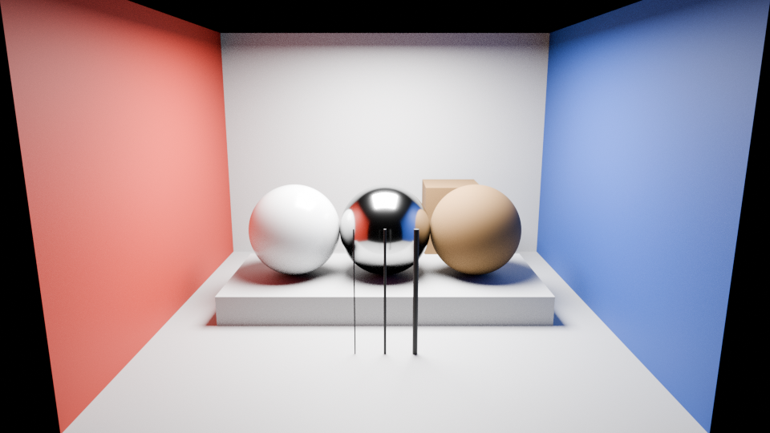
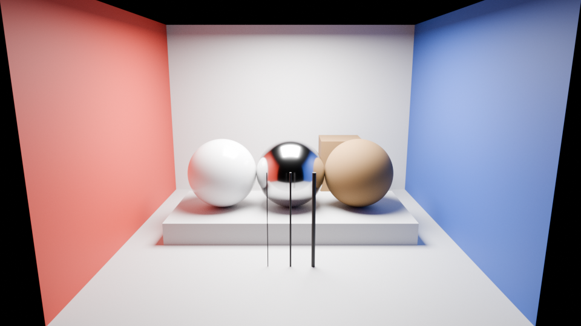

# Material room

An original controlled scene provides aligned references for lighting and material experiments. It contains a neutral room with colored walls, three material spheres, a box and three thin posts. All geometry, material constants, lighting and camera settings come from one versioned JSON file.

These are synthetic renders made in Blender Cycles. The source limits light transport to one bounce; the reference allows twelve. **Neither image is an Enfusion render or a neural result.** The pair can test a training method before an Enfusion appearance dataset is available.

<figure class="scene-image"><a href="media/material-room-source.png"></a><figcaption>Source · one bounce · 512 samples per pixel</figcaption></figure>

<figure class="scene-image"><a href="media/material-room-reference.png"></a><figcaption>Reference · twelve bounces · 4096 samples per pixel</figcaption></figure>

## Scene contract

`scenes/material-room-v1.json` records dimensions, metre-based coordinates, a 42° vertical field of view, a square area light and linear base colors. The materials cover smooth dielectric, rough dielectric and metal. Foreground post diameters are 15, 30 and 60 mm.

The PNGs share AgX display transformation, look, exposure and gamma. The EXRs retain 32-bit scene-linear RGBA, depth, normals and object IDs. The generator also saves an editable `.blend` and an original mesh `.fbx` for a future engine import. No external textures or downloaded assets are used.

## Verification

Source and reference **depth and object-ID passes match exactly**. Their estimated image translation is [0,0]. Normal passes have small differences from filtered sampling; the report retains their maximum and mean errors. No image warp or color matching is applied.

A second 4096-sample render uses an independent random seed to measure remaining reference noise. Its mean absolute RGB difference is approximately **0.36 code values**, below the initial 0.5 threshold; relative RMSE in scene-linear RGB is about **0.5%**. The source/reference RGB MAE is about **3.91**. Finite-sample references still contain noise and renderer assumptions; these measures do not establish photographic truth.

The [reference report](https://github.com/ethan03805/enfusion-neural/blob/main/evidence/material-room-v1.json) retains exact values, render settings, hashes and checks. Full EXRs and editable scene files stay in the local experiment directory. The two reviewed PNGs are unchanged copies of the rendered outputs.

## Reproduce

Use an installed Blender with Cycles. The command defaults to CPU; HIP execution requires selecting one exact device name explicitly. No command installs a driver or provisions hardware.

```powershell
blender --background --factory-startup --python-exit-code 1 --python scripts/render_material_room.py -- --out experiments/local/material-room-01
python -m pip install -e ".[references]"
python scripts/check_material_room.py --root experiments/local/material-room-01 --out experiments/local/material-room-01/check.json
```

The checker reads every EXR part, verifies file hashes, checks geometry alignment and measures the independent seed difference. It returns an error when an acceptance check fails and retains the report. The generator never denoises the reference.

## Training use

The [lighting study](lighting-study.md) now uses this room for a controlled within-scene experiment. Its paired renders use equal sample counts and change only diffuse-bounce depth. It trains and compares scene-conditioned, RGB-only and affine corrections; it does not use the original unequal-sample pair as its training dataset.

Keep this entire scene in one diagnostic group. Moving its camera, changing a material or rendering more noise seeds does not create an independent test scene. Add distinct scene families and asset provenance before assigning train, validation and test splits.

A model trained only on this synthetic source cannot establish improvement in Enfusion. The next data step is to import the original geometry, reproduce the camera and lighting in an isolated engine scene, and check depth, silhouettes, normals, material interpretation and color transfer against these references. Engine exports must pass that check before becoming paired appearance data.

## Engine import controls

Seven isolated Workbench trials have not produced a usable room. All seven addons passed native script validation. Registration and the FBX handler stalled when starting with the unregistered source. Explicit model metadata allowed a build to finish, but its TXO contained only header tags and its XOB was 80 bytes. A fresh process could load that resource and reported **zero materials**. Load success alone is therefore insufficient.

Blender independently reads all 12 meshes from the original FBX. A derived export adds explicit `_LOD0` object names; topology and material slots survive its roundtrip, with maximum coordinate drift below one micrometre. That export produced the same empty TXO/XOB. Calling the FBX handler after registration also returned, but retained the empty output. These observations narrow the import problem without establishing its cause.

The [trial report](https://github.com/ethan03805/enfusion-neural/blob/main/evidence/enfusion-material-import-v1.json) preserves every outcome and asset hash. The [review](https://github.com/ethan03805/enfusion-neural/blob/main/evidence/enfusion-material-import-review-v1.json) records the manually stopped trial and the earlier check that incorrectly accepted an empty resource. The current gate rejects missing or zero material sections. No imported-room picture exists to publish.

Next, inspect the model import configuration and material assignments through the supported Workbench workflow. Require visible geometry, expected dimensions, all material regions and the original camera before comparing lighting. A matching camera needs approximately −12.53° pitch; the capture adapter now supports pitched paths, with CPU direction/readback checks and native compile validation. A pitched engine capture remains unverified. Geometry import and renderer integration are separate requirements.

The probe tools are `scripts/prepare_enfusion_material_room.py`, `scripts/import_enfusion_material_room.py` and `scripts/summarize_enfusion_material_import.py`. Use `--help` for inputs and choose new output directories. The preparation script runs inside Blender and requires `--` before its arguments. Retain failed runs; do not promote a resource load to an accepted appearance pair.
