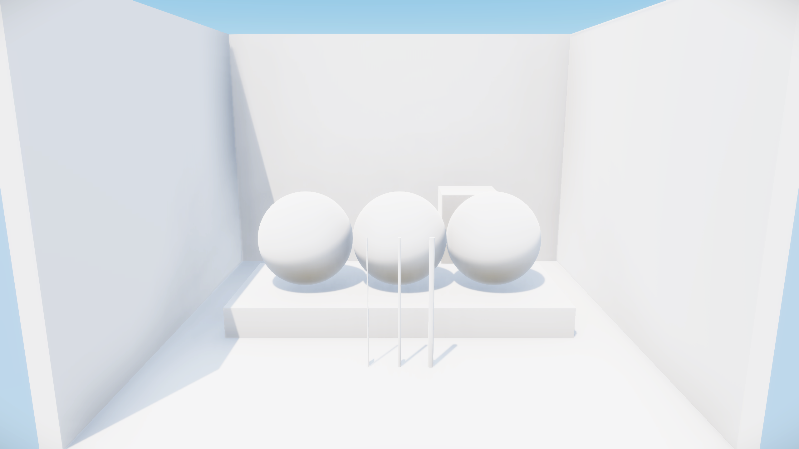

# Material room

An original controlled scene provides aligned references for lighting and material experiments. It contains a neutral room with colored walls, three material spheres, a box and three thin posts. All geometry, material constants, lighting and camera settings come from one versioned JSON file.

These are synthetic renders made in Blender Cycles. The source limits light transport to one bounce; the reference allows twelve. **Neither image is an Enfusion render or a neural result.** The pair can test a training method before an Enfusion appearance dataset is available.

<figure class="scene-image"><a href="media/material-room-source.png"></a><figcaption>Source · one bounce · 512 samples per pixel</figcaption></figure>

<figure class="scene-image"><a href="media/material-room-reference.png"></a><figcaption>Reference · twelve bounces · 4096 samples per pixel</figcaption></figure>

## Scene contract

`scenes/material-room-v1.json` records dimensions, metre-based coordinates, a 42° vertical field of view, a square area light and linear base colors. The materials cover smooth dielectric, rough dielectric and metal. Foreground post diameters are 15, 30 and 60 mm.

The PNGs share AgX display transformation, look, exposure and gamma. The EXRs retain 32-bit scene-linear RGBA, depth, normals and object IDs. The generator also saves an editable `.blend` and an original mesh `.fbx` for a future engine import. No external textures or downloaded assets are used.

## Verification

Source and reference **depth and object-ID passes match exactly**. Their estimated image translation is [0,0]. Normal passes have small differences from filtered sampling; the report retains their maximum and mean errors. No image warp or color matching is applied.

A second 4096-sample render uses an independent random seed to measure remaining reference noise. Its mean absolute RGB difference is approximately **0.36 code values**, below the initial 0.5 threshold; relative RMSE in scene-linear RGB is about **0.5%**. The source/reference RGB MAE is about **3.91**. Finite-sample references still contain noise and renderer assumptions; these measures do not establish photographic truth.

The [reference report](https://github.com/ethan03805/enfusion-neural/blob/main/evidence/material-room-v1.json) retains exact values, render settings, hashes and checks. Full EXRs and editable scene files stay in the local experiment directory. The two reviewed PNGs are unchanged copies of the rendered outputs.

## Reproduce

Use an installed Blender with Cycles. The command defaults to CPU; HIP execution requires selecting one exact device name explicitly. No command installs a driver or provisions hardware.

```powershell
blender --background --factory-startup --python-exit-code 1 --python scripts/render_material_room.py -- --out experiments/local/material-room-01
python -m pip install -e ".[references]"
python scripts/check_material_room.py --root experiments/local/material-room-01 --out experiments/local/material-room-01/check.json
```

The checker reads every EXR part, verifies file hashes, checks geometry alignment and measures the independent seed difference. It returns an error when an acceptance check fails and retains the report. The generator never denoises the reference.

## Training use

The [lighting study](lighting-study.md) now uses this room for a controlled within-scene experiment. Its paired renders use equal sample counts and change only diffuse-bounce depth. It trains and compares scene-conditioned, RGB-only and affine corrections; it does not use the original unequal-sample pair as its training dataset.

Keep this entire scene in one diagnostic group. Moving its camera, changing a material or rendering more noise seeds does not create an independent test scene. Add distinct scene families and asset provenance before assigning train, validation and test splits.

A model trained only on this synthetic source cannot establish improvement in Enfusion. The original geometry and camera now have an engine control below. Materials, lighting, shading normals, silhouettes and color transfer still need calibration before the captures become paired appearance data.

## Engine import controls

The original room now renders in an isolated Enfusion simulation. All **12 meshes and 18,390 vertex positions** survive import. Comparing the unchanged original FBX with Workbench's TXO gives a maximum coordinate difference of **0.62 micrometres**, using the expected `[x,y,z] → [x,z,y]` axis mapping without fitting or reordering. Native entity bounds, seven material regions and the reference camera's approximately −12.53° pitch pass readback checks.

<figure class="scene-image"><a href="media/material-room-engine-geometry.png"></a><figcaption>Enfusion · imported geometry · default white materials and outdoor lighting · no neural processing</figcaption></figure>

The earlier header-only imports exposed a bug in our probe: it requested `Workbench.Exit` immediately after queuing an asynchronous rebuild. Keeping the private editor alive produces complete geometry for both the unchanged original and the LOD0-named variant. A fresh project also builds and loads correctly. The rename is unnecessary for this fixture. Earlier empty results do not establish an asset-format limitation.

The [geometry report](https://github.com/ethan03805/enfusion-neural/blob/main/evidence/enfusion-room-geometry-v1.json) binds three completed build controls, three separate native loads, two vertex comparisons and two inspected captures. The [seven earlier trials](https://github.com/ethan03805/enfusion-neural/blob/main/evidence/enfusion-material-import-v1.json) and their [review](https://github.com/ethan03805/enfusion-neural/blob/main/evidence/enfusion-material-import-review-v1.json) remain unchanged. One subsequent script compilation failure is also retained.

The white materials and outdoor illumination differ visibly from the Cycles reference. This is a geometry and camera control, **not an accepted appearance pair**. Next map the original material constants, isolate and match illumination, and verify the exposure/color convention. Compiled-mesh quantization, shading normals, UVs and raster silhouettes also need separate checks. Renderer buffer access and neural output composition remain unresolved.

The default import route keeps the editor alive while observing the rebuild, then stops only its owned process. Loading happens in a second process that must exit naturally. These commands use the hash-bound original FBX retained by the material-room experiment; choose new output directories and provide the installed Enfusion Lab source directory.

```powershell
python scripts/import_enfusion_material_room.py --source-root experiments/local/material-room-v1d --out experiments/local/room-build --lab-source PATH_TO_LAB
python scripts/import_enfusion_material_room.py --source-root experiments/local/material-room-v1d --out experiments/local/room-load --route load-completed --built-import experiments/local/room-build --lab-source PATH_TO_LAB
python scripts/capture_enfusion_material_room.py --loaded-import experiments/local/room-load --out experiments/local/room-capture --lab-source PATH_TO_LAB
```

Use `scripts/check_enfusion_room_geometry.py` inside Blender to compare every TXO vertex with the original FBX. The naming-only exporter and the earlier failing import routes remain available for reproducing controls; they are not required by the working path. A regenerated source needs a reviewed source record before replacing the retained FBX.

## Surface controls

The [surface report](https://github.com/ethan03805/enfusion-neural/blob/main/evidence/enfusion-room-surface-v1.json) extends the check to **18,570 faces and 73,872 face corners** across all 12 meshes. Face connectivity and named material assignments match. Every face reverses its cyclic order under the reflected axis mapping. This checks the TXO intermediary; compiled shading and raster silhouettes remain unverified.

| Check | Observed result |
| --- | --- |
| Maximum normal component difference | 0.00005004; declared limit 0.00002 |
| Maximum normal angle difference | 0.0044° |
| Maximum UV difference after `v → 1 − v` | 0.000005; declared limit 0.000002 |
| Strict surface result | Six box meshes pass; three spheres and three posts fail |

The initial failed result is retained. A follow-up with unchanged tolerances finds all imported normals on a four-decimal grid and all UVs on a five-decimal grid. This is consistent with serialization precision, but rounding the source does not exactly reproduce every sphere value. It does not prove the precision of the compiled XOB or texture sampling orientation. The checker is `scripts/check_enfusion_room_surface.py`, run inside Blender with the same source/load arguments as the vertex checker and a new `--out` path.

A separate native read-only inspection successfully loads the original neutral `MatPBRBasic` container and enumerates 142 fields. `Color` has a white default; scalar readback gives `RoughnessScale = 1` and `MetalnessScale = 1`. `BCRMap` and `NMOMap` fields are present. These observations establish the available schema, **not the meaning of its color transfer or texture channels**. No material was changed. Bohemia documents that the [prop importer creates default MatPBRBasic materials](https://community.bistudio.com/wiki/Arma_Reforger%3AProp_Creation).

Next use an asymmetric original texture and controlled light to check orientation and material response, then calibrate illumination and color/exposure against the reference. Preserve the white-material image above. Accept a pair only after geometry, materials, camera and lighting conventions are accounted for; resolve neural input/output integration separately.
