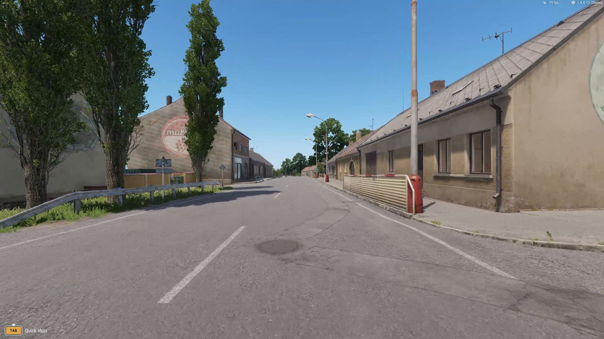
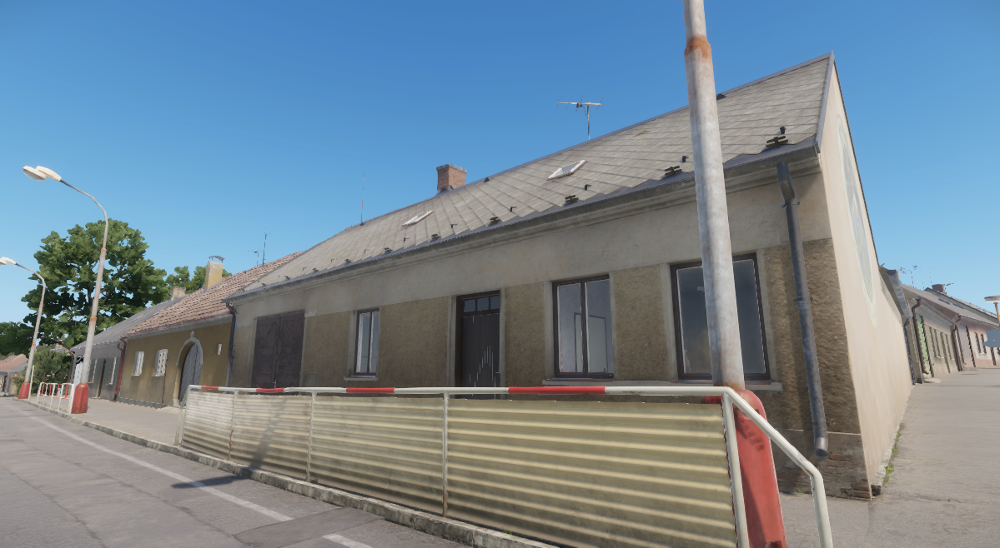
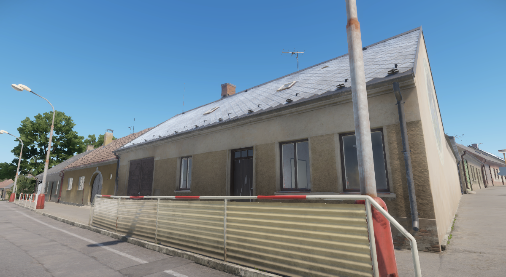
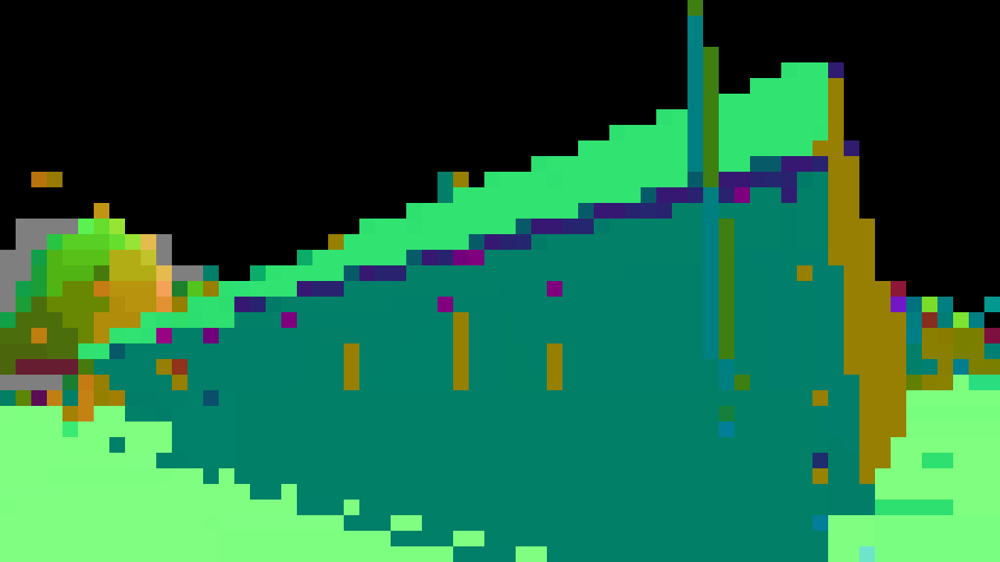
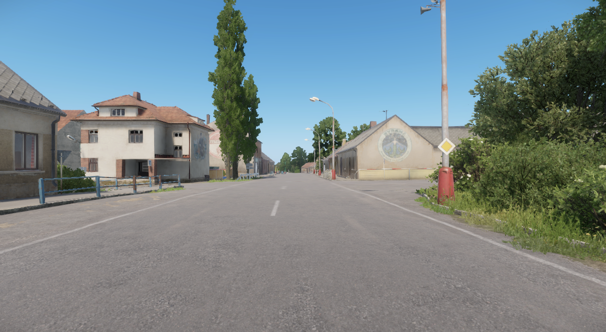
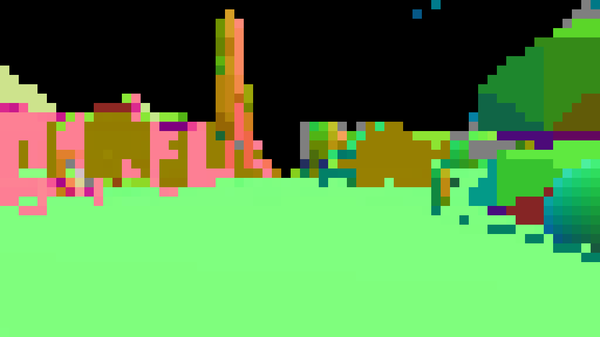

# Appearance candidates

The working build still uses bounded Zero-DCE++ exposure curves. **No evaluated candidate yet establishes substantial photorealistic material and lighting improvement.** All candidates receive captured RGB with HUD; depth, normals, material labels and motion buffers are unavailable.

| Candidate | Measured result | Decision |
| --- | --- | --- |
| Zero-DCE++ | Native GPU copy/network/draw 3.44 ms median in the town path | Working exposure pass; modest appearance change |
| Image-Adaptive-3DLUT | Raw photographic output clips 4.92–6.95% of channels on two views | Rejected: shaded foliage loses detail |
| REGEN GTA2Cityscapes | RX 7800 XT DirectML FP32, 960 × 544: 53.24 / 53.98 / 53.63 ms median, five synchronized samples per view | Rejected: altered roof identity, sky artifacts, fine-detail loss and excessive cost |
| DeepLPF Adobe-DPE | CPU FP32, 960 × 544: 602 / 473 / 462 ms; 7.64 / 3.42 / 8.86% of channels clamp to black | Raw output rejected; protected version avoids clipping but gives insufficient appearance gain |
| SPAN x2, 48 channels | RX 7800 XT DirectML, 1280 × 720 → 2560 × 1440: 69–72 ms FP32 / 35–37 ms FP16 median | Better restoration than bicubic; too costly for live integration, and no material/lighting gain |

## RGB detail restoration

[SPAN](https://github.com/hongyuanyu/SPAN) receives four gameplay images after synthetic bicubic downsampling to 1280 × 720. Its 1440p reconstruction is compared with bicubic interpolation from the same input and the original capture. This measures recovery of removed detail, **not improvement beyond the original game or photographic ground truth**.

| View | FP32 median | FP16 median | FP32 PSNR gain over bicubic |
| --- | --- | --- | --- |
| Road and sign | 71.20 ms | 36.16 ms | +2.16 dB |
| Facade and openings | 70.06 ms | 35.38 ms | +2.13 dB |
| Tree and foliage | 69.32 ms | 35.39 ms | +1.93 dB |
| Slate-roof street | 72.17 ms | 36.83 ms | +1.96 dB |

Both variants run on DirectML without CPU fallback. The longer first-view sample has p95 **107.39 ms FP32 / 43.27 ms FP16**, with 20 timed calls after five warmups; the other views have five timed calls each. Calls include upload and readback with the game stopped. Both fail the declared 20 ms provisional budget. CPU parity passes; the initial FP16 export-order failure and corrected graph are retained.

<section class="comparison" data-comparison data-before-label="bicubic" data-after-label="SPAN reconstruction" aria-label="SPAN restoration versus bicubic interpolation">

<figure class="comparison-before"><figcaption>Bicubic · from synthetic 720p input</figcaption></figure>
<figure class="comparison-after"><figcaption>SPAN FP32 · same input</figcaption></figure>

<label class="comparison-control" hidden>Reveal bicubic<input type="range" min="0" max="100" value="50" aria-label="SPAN bicubic visible"><output>50% bicubic</output></label>
</section>

Compare the [original 1440p capture](media/span-street-original.png) and [bounded residual diagnostic](media/span-street-protected.png). SPAN restores more roof and facade detail than bicubic, while the original retains finer foliage and road detail. Adding a small protected residual to the original produces slight sharpening, with no demonstrated material-response or lighting improvement. It also introduces 0.0081–0.0277% newly black channels across the four views. **Live integration is rejected.** Motion and full-application performance were not tested for this graph.

The [complete SPAN evidence](https://github.com/ethan03805/enfusion-neural/blob/main/evidence/span-evaluation-v1.json) records all samples, hashes, precision checks, failed export and residual parameters. Reproduce with `scripts/prepare_span.py`, `scripts/evaluate_span.py --out NEW_DIRECTORY`, `scripts/evaluate_span_half.py --out NEW_DIRECTORY` and `scripts/diagnose_span_residual.py --out NEW_DIRECTORY`. The latter two consume the retained `runs/span-evaluation-v1` result. The author archive is 1.33 GB; only the selected 17.9 MB checkpoint is extracted. No model is added to the playable package.

Earlier REGEN and DeepLPF comparisons

REGEN timing includes upload and readback, excludes file handling and initialization, and was measured with the game stopped. It is **not pure GPU dispatch time or application FPS**. Its independent CPU/DirectML comparison passes: maximum absolute error 0.00002271 in the −1…1 model output. All 18 profiled inference events ran on DirectML; CPU fallback was disabled. Even this lower-resolution transfer-inclusive call exceeds the 33.3 ms whole-frame budget. DeepLPF has no measured GPU timing yet.

## Three fixed gameplay views

The road/sign, facade after turning, and near-tree/foliage frames were selected before inference. These are raw, unbounded model results at **960 × 544**, resized from retained 1440p gameplay. They are not aligned photographic reference targets. Inspect the full images for signs, openings, fences, roof color and foliage gaps.

| View | REGEN input / raw output | DeepLPF input / raw output |
| --- | --- | --- |
| Road and sign | [Input](media/regen-00-source.png) · [Raw](media/regen-00-raw.png) | [Input](media/deeplpf-00-source.png) · [Raw](media/deeplpf-00-raw.png) |
| Facade and openings | [Input](media/regen-01-source.png) · [Raw](media/regen-01-raw.png) | [Input](media/deeplpf-01-source.png) · [Raw](media/deeplpf-01-raw.png) |
| Tree and foliage | [Input](media/regen-02-source.png) · [Raw](media/regen-02-raw.png) | [Input](media/deeplpf-02-source.png) · [Raw](media/deeplpf-02-raw.png) |

<section class="comparison" data-comparison aria-label="Rejected REGEN facade output">

<figure class="comparison-before"><figcaption>Source · resized evaluation input</figcaption></figure>
<figure class="comparison-after"><figcaption>REGEN · rejected raw output</figcaption></figure>

<label class="comparison-control" hidden>Reveal source<input type="range" min="0" max="100" value="50" aria-label="REGEN source visible"><output>50% original</output></label>
</section>

REGEN changes the orange roof to green/gray, desaturates the blue pole and adds coarse texture to the sky. Fine signs, flowers and leaves soften. Correct GPU execution does not make this a faithful appearance model.

<section class="comparison" data-comparison aria-label="DeepLPF foliage visibility regression">

<figure class="comparison-before"><figcaption>Source · resized evaluation input</figcaption></figure>
<figure class="comparison-after"><figcaption>DeepLPF · raw visibility regression</figcaption></figure>

<label class="comparison-control" hidden>Reveal source<input type="range" min="0" max="100" value="50" aria-label="DeepLPF source visible"><output>50% original</output></label>
</section>

DeepLPF retains the roof's color and adds contrast, but shaded openings and foliage lose visibility. Its parameter filters operate on learned features; they do not guarantee source pixel identity.

## Source-protected diagnostic

A follow-up transfers only a smoothed, bounded RGB gain to the original 1440p pixels. It preserves source shadows below luminance 0.16, limits channel changes to 0.09, protects highlights and fixed HUD areas, and attenuates regions where the model approaches clipping. These are numerical guards, not semantic reconstruction detection.

<section class="comparison" data-comparison aria-label="Offline protected DeepLPF transfer at 1440p">

<figure class="comparison-before"><figcaption>Original 1440p source</figcaption></figure>
<figure class="comparison-after"><figcaption>Protected DeepLPF transfer · offline</figcaption></figure>

<label class="comparison-control" hidden>Reveal source<input type="range" min="0" max="100" value="50" aria-label="Protected transfer source visible"><output>50% original</output></label>
</section>

All three diagnostic frames avoid new black clipping and leave the declared darkest source regions unchanged. Mean absolute RGB change is 0.0355 / 0.0245 / 0.0163. The result is still a color/contrast adjustment; substantial material and lighting improvement is not demonstrated. **This integration attempt is closed.** GPU conversion and motion tests would not resolve the missing appearance gain, so they were not pursued.

## Reproduce and inspect

### Material references

Three [CC0](https://polyhaven.com/license) material references are now retained locally with their 1K color, roughness and DirectX normal maps. Their downloaded bytes match the author's checksums; our evidence also records SHA-256, dimensions and provenance.

| Gameplay material | Reference | Applicability limit |
| --- | --- | --- |
| Town road | [Asphalt 02, Rob Tuytel](https://polyhaven.com/a/asphalt_02) | Useful aggregate and matte-response reference; cracks, markings and wear differ |
| Orange town roof | [Roof Tiles, Stephan Seeliger](https://polyhaven.com/a/roof_tiles) | Terracotta appearance reference; tile geometry and arrangement differ |
| Near-tree trunk | [Bark Brown 01, Rob Tuytel](https://polyhaven.com/a/bark_brown_01) | Furrowed bark reference; species and groove placement are not matched |

These are material-category references, **not aligned training targets or replacement game textures**. No model was trained and no game asset changed. `scripts/prepare_appearance_references.py` reproduces the 25.1 MB reference set; [reference evidence](https://github.com/ethan03805/enfusion-neural/blob/main/evidence/playable-appearance-references-v1.json) records the distinction.

### Existing street material

Read-only Workbench inspection now identifies one existing building on the accepted street route: `House_Village_E_1L02t`. Its mesh reports roof and exterior-wall slots. Three uniquely matching material resources load as `MatPBRMulti` containers, exposing the following native texture references:

| Surface | Observed material inputs | Remaining uncertainty |
| --- | --- | --- |
| Roof | Slate BCR/NMO, brick, bare concrete, wood and dirt layers | Per-instance overrides and decoded texture data |
| Exterior wall | White/rough plaster, exposed brick, peeling-paint masks and concrete normal map | Exact layer blending and an aligned appearance target |
| Wall variant | Bare plaster, brick and damage masks | Which surfaces use this variant in the placed instance |

<figure>

<figcaption>Material identity survey · complete native Workbench image, 1199 × 658 · no neural processing</figcaption>
</figure>

This view confirms the building and its visible slate roof, openings and cover. It is a separate Workbench simulation with its own rendering settings, not a gameplay comparison or photorealistic reference. [Exact resource links and survey hashes](https://github.com/ethan03805/enfusion-neural/blob/main/evidence/playable-material-identity-v1.json).

A follow-up reads explicit **13-slot material defaults** from the house's native prefab, confirming the three roof/wall associations. The editor instance source is unavailable during simulation, so runtime overrides remain unverified. The one declared native-file access run times out after 60 seconds before reporting its first file result and produces no files. It does not prove the requested textures are absent. This access route is closed with [code, logs and evidence retained](https://github.com/ethan03805/enfusion-neural/blob/main/evidence/playable-material-access-v1.json).

Bohemia's [texture documentation](https://community.bistudio.com/wiki/Arma_Reforger:Textures) defines BCR as base color plus roughness and NMO as normal XY, metalness and occlusion. These describe the format contract; actual dimensions and pixels remain unvalidated. No native texture has been extracted, no asset changed and no aligned photographic target established.

### Native material response

The documented [Material API](https://community.bistudio.com/wikidata/external-data/arma-reforger/EnfusionScriptAPIPublic/interfaceMaterial.html) now produces a verified response on this roof without copying textures. A private Workbench sequence captures the source, sets cached `RoughnessScale` from its observed default 1 to **0.05**, then resets it. The camera remains fixed and all three images are inspected. **The exaggerated sheen is a control, not an accepted appearance improvement or neural output.**

<section class="comparison" data-comparison data-before-label="source" data-after-label="roughness diagnostic" aria-label="Native roof roughness control">

<figure class="comparison-before"><figcaption>Source · native roof material</figcaption></figure>
<figure class="comparison-after"><figcaption>RoughnessScale 0.05 · diagnostic extreme</figcaption></figure>

<label class="comparison-control" hidden>Reveal source<input type="range" min="0" max="100" value="50" aria-label="Material control source visible"><output>50% source</output></label>
</section>

| Mean absolute RGB difference from source | Changed | Reset |
| --- | --- | --- |
| Declared roof region | 26.1407 codes | 0.0403 codes |
| Declared sky region | 0.0085 codes | 0.0300 codes |
| Complete image | 1.9508 codes | 0.2378 codes |

All declared localization/restoration gates pass. The [reset image](media/material-control-restored.png) returns the roof's original response. Complete-frame restoration is not exact: the maximum difference is 178 codes at a foliage pixel. No registration, resizing or exposure correction hides this difference. Source, changed and reset captures span seven simulation seconds.

This establishes a useful native material control with the original slate layout, geometry and texture references. The cached material may be shared by other instances; per-instance isolation is not established. It supplies no live surface buffer and changes neither the companion nor its download. The [complete evidence](https://github.com/ethan03805/enfusion-neural/blob/main/evidence/playable-material-control-v1.json) retains the plan, successful validation, API results and all image hashes. Reproduce setup with `scripts/setup_playable_material_control.py`, validate/capture through Enfusion Lab, then run `scripts/analyze_material_control.py` on that run.

### Collision geometry diagnostic

A bounded probe samples 2,304 scene rays in each of two street views. The returned geometry identifies broad roof, wall and road surfaces, but **this grid is rejected as a live lighting input**. It costs 16–25 ms on the CPU before any bridge or neural processing and cannot certify thin cover, foliage gaps or openings.

| View | ENTS + WORLD, all three grid times | With VISIBILITY | Hits without / with VISIBILITY | Zero-normal hits with VISIBILITY |
| --- | --- | --- | --- | --- |
| Roof close-up | 24 / 24 / 24 ms | 24 / 25 / 23 ms | 1,494 / 1,510 | 20 |
| Street approach | 17 / 17 / 16 ms | 16 / 19 / 17 ms | 1,631 / 1,643 | 25 |

These integer-millisecond Workbench measurements include ray setup, queries, allocations and metadata; they exclude logging, game frame time and companion processing. Collision normals are not rendered shading normals. The first float-coordinate control fails the declared 0.5-pixel projection limit at 1.389 pixels; the second view uses explicit integer coordinates and passes at 0.142 pixels. The original failure remains recorded. `TraceDist` returns large signed values and is not treated as distance along the ray.

Inspect both geometry views and retained failures

<figure>

<figcaption>Original close-up · native 1199 × 658 Workbench capture</figcaption>
</figure>
<figure>

<figcaption>64 × 36 collision grid with VISIBILITY, nearest enlarged · RGB encodes world normal, black is no hit, gray is a zero normal · diagnostic, not a renderer buffer</figcaption>
</figure>
<figure>

<figcaption>Original street approach · native 1199 × 658 Workbench capture</figcaption>
</figure>
<figure>

<figcaption>Same normal encoding · broad foliage proxies do not reproduce visible leaves or gaps</figcaption>
</figure>

All three compile attempts and both captures are retained, including the initial `Material` field-name collision. The corrected addon validates and exports both views. Roof edges are coarse grid steps; gutters, antennae and window recesses are unresolved. Closed doors in these views do not validate traversable openings. The screenshot follows the probe and is not a synchronized depth attachment.

The [complete geometry evidence](https://github.com/ethan03805/enfusion-neural/blob/main/evidence/playable-geometry-probe-v1.json) records every timing, projection control, hit identity and source hash. `scripts/setup_playable_geometry_probe.py` creates an isolated addon for Enfusion Lab validation/capture; `scripts/analyze_geometry_probe.py` parses the retained logs and reproduces the maps. The live companion and download are unchanged. Offline sparse use remains possible; this per-frame grid is closed.

### Candidate replay

[REGEN author implementation](https://github.com/stefanos50/REGEN), revision `de240056522d066235b48b541e7d49f28c80f1ed`, provides the GTA2Cityscapes checkpoint and ONNX generator. [DeepLPF author implementation](https://github.com/sjmoran/deeplpf-image-enhancement), revision `b6d6764b548667f51eda2f1a6aafd484822de3ec`, provides the Adobe-DPE checkpoint. Author licenses and complete source hashes are retained with each evaluation. No new model is bundled in the playable download.

The optional Windows/Python 3.9 evaluation environment is pinned in `requirements-evaluation.txt`; install CPU PyTorch separately as directed there. Run `scripts/prepare_rgb_candidates.py --model regen` or `--model deeplpf`, then the corresponding `scripts/evaluate_regen.py --out NEW_DIRECTORY` or `scripts/evaluate_deeplpf.py --out NEW_DIRECTORY`. This downloads public author files into ignored `runs/pretrained/` and verifies the measured hashes. REGEN also requires the built `enr_adapter_info` helper to identify the actual DirectML adapter.

Exact checkpoint hashes, plans, raw samples, source-protection parameters and limitations are recorded in [REGEN evidence](https://github.com/ethan03805/enfusion-neural/blob/main/evidence/regen-evaluation-v1.json) and [DeepLPF evidence](https://github.com/ethan03805/enfusion-neural/blob/main/evidence/deeplpf-evaluation-v1.json). Both evaluators load weights with restricted `weights_only=True`. `scripts/diagnose_deeplpf_transfer.py` reproduces the protected diagnostic from saved outputs.

The evaluators replay retained local gameplay captures. A fresh repository clone also needs the original files named in the evaluation plans; the playable download itself does not depend on these research inputs.

[Playable build and measured gameplay](playable.md) · [Current status](status.md)
