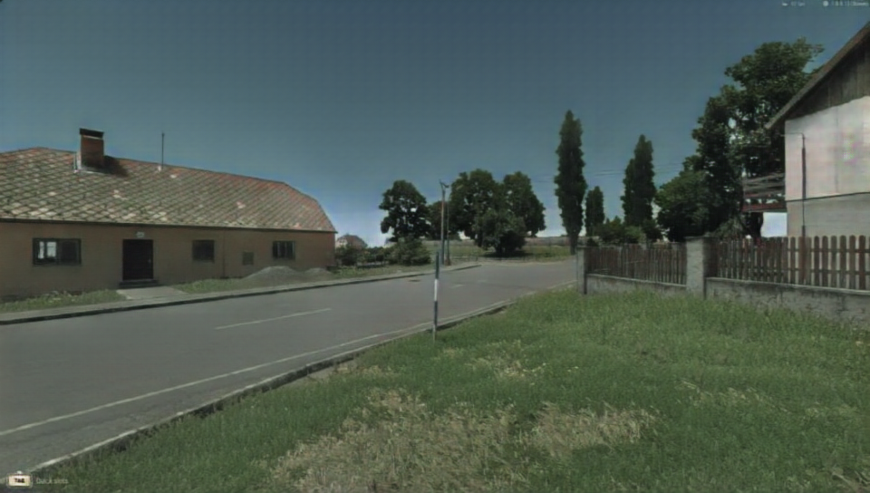
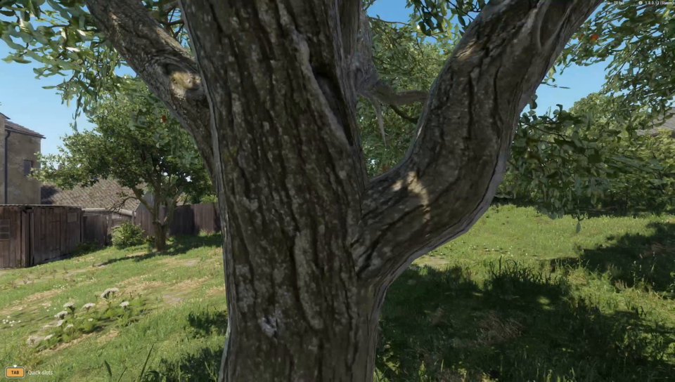
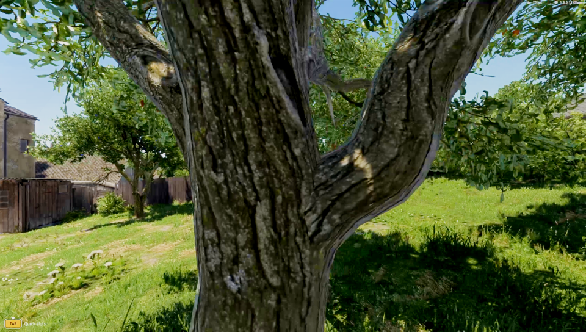
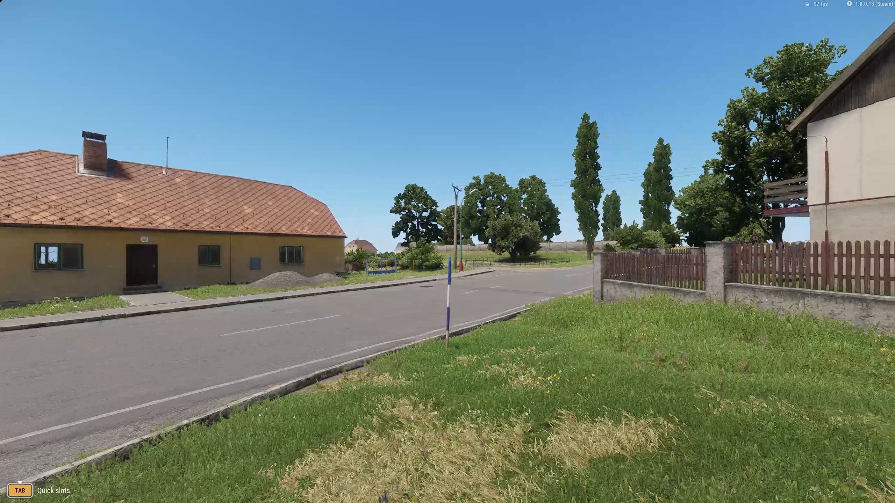
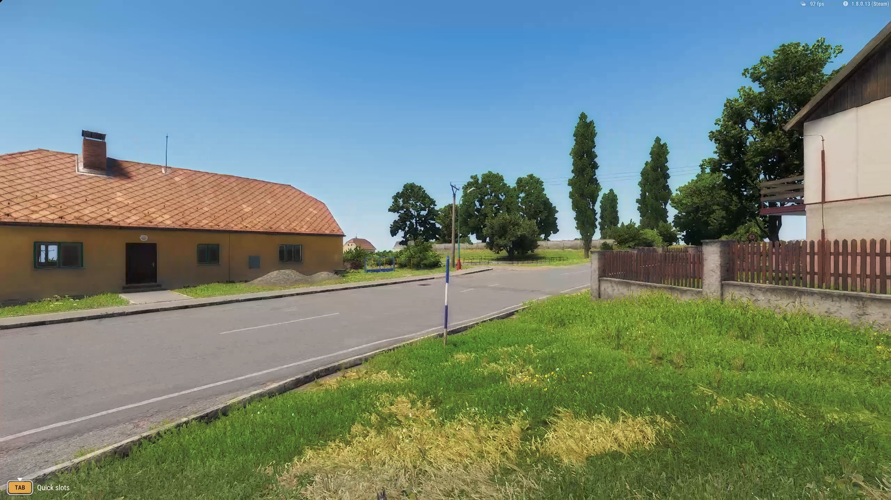

# Appearance candidates

The working build still uses bounded Zero-DCE++ exposure curves. **No evaluated candidate yet establishes substantial photorealistic material and lighting improvement.** All candidates receive captured RGB with HUD; depth, normals, material labels and motion buffers are unavailable.

| Candidate | Measured result | Decision |
| --- | --- | --- |
| Zero-DCE++ | Native GPU copy/network/draw 3.44 ms median in the town path | Working exposure pass; modest appearance change |
| Image-Adaptive-3DLUT | Raw photographic output clips 4.92–6.95% of channels on two views | Rejected: shaded foliage loses detail |
| REGEN GTA2Cityscapes | RX 7800 XT DirectML FP32, 960 × 544: 53.24 / 53.98 / 53.63 ms median, five synchronized samples per view | Rejected: altered roof identity, sky artifacts, fine-detail loss and excessive cost |
| DeepLPF Adobe-DPE | CPU FP32, 960 × 544: 602 / 473 / 462 ms; 7.64 / 3.42 / 8.86% of channels clamp to black | Raw output rejected; protected version avoids clipping but gives insufficient appearance gain |

REGEN timing includes upload and readback, excludes file handling and initialization, and was measured with the game stopped. It is **not pure GPU dispatch time or application FPS**. Its independent CPU/DirectML comparison passes: maximum absolute error 0.00002271 in the −1…1 model output. All 18 profiled inference events ran on DirectML; CPU fallback was disabled. Even this lower-resolution transfer-inclusive call exceeds the 33.3 ms whole-frame budget. DeepLPF has no measured GPU timing yet.

## Three fixed gameplay views

The road/sign, facade after turning, and near-tree/foliage frames were selected before inference. These are raw, unbounded model results at **960 × 544**, resized from retained 1440p gameplay. They are not aligned photographic reference targets. Inspect the full images for signs, openings, fences, roof color and foliage gaps.

| View | REGEN input / raw output | DeepLPF input / raw output |
| --- | --- | --- |
| Road and sign | [Input](media/regen-00-source.png) · [Raw](media/regen-00-raw.png) | [Input](media/deeplpf-00-source.png) · [Raw](media/deeplpf-00-raw.png) |
| Facade and openings | [Input](media/regen-01-source.png) · [Raw](media/regen-01-raw.png) | [Input](media/deeplpf-01-source.png) · [Raw](media/deeplpf-01-raw.png) |
| Tree and foliage | [Input](media/regen-02-source.png) · [Raw](media/regen-02-raw.png) | [Input](media/deeplpf-02-source.png) · [Raw](media/deeplpf-02-raw.png) |

<section class="comparison" data-comparison aria-label="Rejected REGEN facade output">

<figure class="comparison-before"><figcaption>Source · resized evaluation input</figcaption></figure>
<figure class="comparison-after"><figcaption>REGEN · rejected raw output</figcaption></figure>

<label class="comparison-control" hidden>Reveal source<input type="range" min="0" max="100" value="50" aria-label="REGEN source visible"><output>50% original</output></label>
</section>

REGEN changes the orange roof to green/gray, desaturates the blue pole and adds coarse texture to the sky. Fine signs, flowers and leaves soften. Correct GPU execution does not make this a faithful appearance model.

<section class="comparison" data-comparison aria-label="DeepLPF foliage visibility regression">

<figure class="comparison-before"><figcaption>Source · resized evaluation input</figcaption></figure>
<figure class="comparison-after"><figcaption>DeepLPF · raw visibility regression</figcaption></figure>

<label class="comparison-control" hidden>Reveal source<input type="range" min="0" max="100" value="50" aria-label="DeepLPF source visible"><output>50% original</output></label>
</section>

DeepLPF retains the roof's color and adds contrast, but shaded openings and foliage lose visibility. Its parameter filters operate on learned features; they do not guarantee source pixel identity.

## Source-protected diagnostic

A follow-up transfers only a smoothed, bounded RGB gain to the original 1440p pixels. It preserves source shadows below luminance 0.16, limits channel changes to 0.09, protects highlights and fixed HUD areas, and attenuates regions where the model approaches clipping. These are numerical guards, not semantic reconstruction detection.

<section class="comparison" data-comparison aria-label="Offline protected DeepLPF transfer at 1440p">

<figure class="comparison-before"><figcaption>Original 1440p source</figcaption></figure>
<figure class="comparison-after"><figcaption>Protected DeepLPF transfer · offline</figcaption></figure>

<label class="comparison-control" hidden>Reveal source<input type="range" min="0" max="100" value="50" aria-label="Protected transfer source visible"><output>50% original</output></label>
</section>

All three diagnostic frames avoid new black clipping and leave the declared darkest source regions unchanged. Mean absolute RGB change is 0.0355 / 0.0245 / 0.0163. The result is still a color/contrast adjustment; substantial material and lighting improvement is not demonstrated. **This integration attempt is closed.** GPU conversion and motion tests would not resolve the missing appearance gain, so they were not pursued.

## Reproduce and inspect

[REGEN author implementation](https://github.com/stefanos50/REGEN), revision `de240056522d066235b48b541e7d49f28c80f1ed`, provides the GTA2Cityscapes checkpoint and ONNX generator. [DeepLPF author implementation](https://github.com/sjmoran/deeplpf-image-enhancement), revision `b6d6764b548667f51eda2f1a6aafd484822de3ec`, provides the Adobe-DPE checkpoint. Author licenses and complete source hashes are retained with each evaluation. No new model is bundled in the playable download.

The optional Windows/Python 3.9 evaluation environment is pinned in `requirements-evaluation.txt`; install CPU PyTorch separately as directed there. Run `scripts/prepare_rgb_candidates.py --model regen` or `--model deeplpf`, then the corresponding `scripts/evaluate_regen.py --out NEW_DIRECTORY` or `scripts/evaluate_deeplpf.py --out NEW_DIRECTORY`. This downloads public author files into ignored `runs/pretrained/` and verifies the measured hashes. REGEN also requires the built `enr_adapter_info` helper to identify the actual DirectML adapter.

Exact checkpoint hashes, plans, raw samples, source-protection parameters and limitations are recorded in [REGEN evidence](https://github.com/ethan03805/enfusion-neural/blob/main/evidence/regen-evaluation-v1.json) and [DeepLPF evidence](https://github.com/ethan03805/enfusion-neural/blob/main/evidence/deeplpf-evaluation-v1.json). Both evaluators load weights with restricted `weights_only=True`. `scripts/diagnose_deeplpf_transfer.py` reproduces the protected diagnostic from saved outputs.

[Playable build and measured gameplay](playable.md) · [Current status](status.md)
