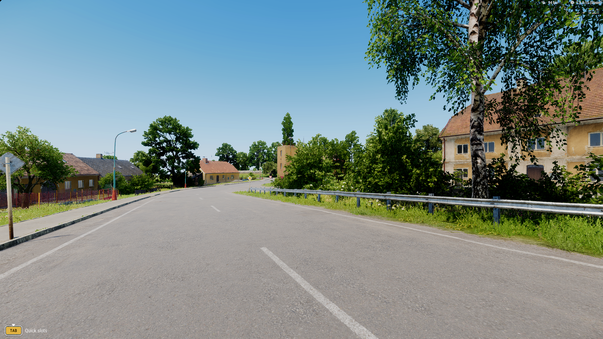
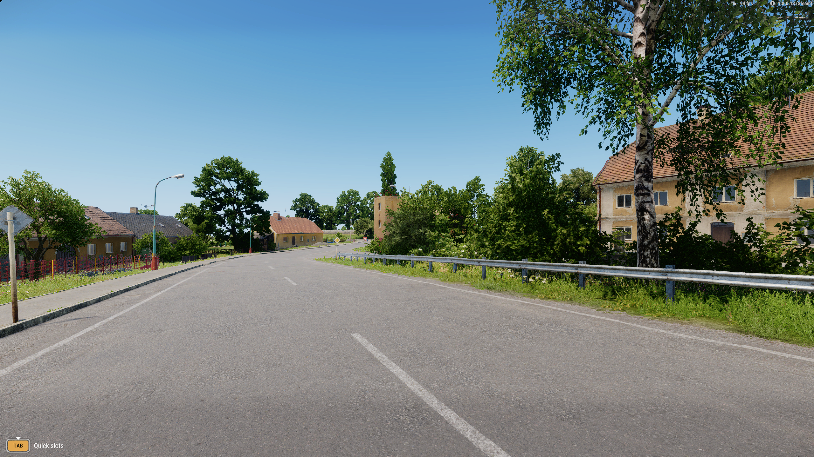

# Playable companion

Updated 10 September 2026. Live processing is working; input verification, controlled comparison and appearance acceptance remain in progress.

## First milestone

Capture the actual single-player game window with Windows Graphics Capture, process its D3D11 texture on the RX 7800 XT, and present through a separate Windows companion. A nonactivating overlay should leave mouse and keyboard input with Reforger. F8 must immediately expose the original game; F9 switches processed/passthrough output; F10 exits the companion. Loss of source frames must expose the game automatically.

This route has display-referred RGB including HUD, with capture timestamps. It has no verified depth, motion, normals, material IDs or scene-linear lighting. The Blender feature model remains background research. Model candidates must accept the available RGB input. No game DLL replacement, injection or Steam asset edits are planned.

The initial Windows capture investigation is limited to 45 minutes of implementation and testing. If occluded capture, input routing or presentation fails, retain the runnable viewer and logs and switch to a separate visible viewer while recording that limitation. Do not repeat the failed in-engine screenshot/widget route.

## Measurement contract

Target 2560 × 1440 at 30–60 FPS in local single-player. Record baseline, reduced-cost engine alone, and the same reduction plus enhancement on the same declared gameplay path. Keep texture and geometry identity, cover and vegetation coverage. Start with render scale, shadow quality and screen-space effects as independent cost candidates.

Record game and companion presents, p50/p95/p99 frame intervals, dropped/stale frames, GPU processing and capture-timestamp-to-present-call age. The latter is software pipeline age, not input-to-photon latency. Display/scanout delay and full input latency require separate evidence. Keep recording overhead separate and preserve real elapsed time in clips.

## Work log

1. Existing code and evidence reviewed. Stable Reforger/Workbench are installed. The public engine interface audit found no supported neural resource bridge. No further speculative engine integration is required before testing the Windows route.
2. Windows companion implementation begun on `prototype/playable-companion`. No pretrained candidate has yet been accepted.

## Sources

- [Microsoft: Windows Graphics Capture](https://learn.microsoft.com/en-us/windows/apps/develop/media-authoring-processing/screen-capture)
- [Microsoft: Win32 window capture sample](https://github.com/microsoft/Windows.UI.Composition-Win32-Samples/tree/master/cpp/ScreenCaptureforHWND)
- [PresentMon measurement tool](https://github.com/GameTechDev/PresentMon)
- [Bohemia: startup parameters](https://community.bistudio.com/wiki/Arma_Reforger:Startup_Parameters)

## Live integration milestone · 10 September

The companion captures 1440p game RGB and runs a real native Zero-DCE++ network. A 320 × 180 FP32 curve matches the independent PyTorch checkpoint with maximum error 0.000000075 over 172,800 values. The native backend retains its source, input, checkpoint and output hashes locally. The candidate changes exposure; substantial photorealistic lighting/material improvement is **not established**.

A normal HWND flip swapchain visibly displays the first-person Montignac scene and is measurable in PresentMon. It replaces DirectComposition, which displayed correctly but escaped the first display trace. Layered-window variants failed to appear. F8 exposes the source game; a retained hotkey log measured 1.38 ms from handling the key to hiding the window. That excludes keyboard sampling. The soldier receives the local player controller; closing Game Master restores its first-person camera. Physical mouse/keyboard operation through the visible overlay still requires complete verification. The automated UI driver rejects a mouse action because the companion covers the game; this remains a test limitation.

Menu plumbing control: 2,397 frames / 40.012 s, exact RGB inversion, GPU copy/draw median 0.08032 ms. This is **not gameplay performance**. A live neural sample reports roughly 5 ms GPU copy/inference/draw. The HWND presentation sample joins 895 displayed frames to the companion log, with 12.61 ms median, 18.12 ms p95 and 20.98 ms p99 capture-to-display software latency. Signed compositor timestamp offsets include negatives and are retained. These numbers exclude input sampling and physical panel response.

The controller ignored both direct movement and input-context writes. The documented `CharacterForward` action succeeds: the soldier follows a roughly 70-metre path over 20 seconds, followed by a 10-second heading sweep. Position and direction logs verify movement. Native-resolution baseline: 114.70 application presents/s, 8.60/10.69/12.05 ms p50/p95/p99 intervals, and 8.46 ms median game GPU activity. No interval exceeds 33.3 ms in this sample. Reduction runs are in progress. Separate PresentMon CPU traces preserve the game presents that display/GPU tracking loses while an overlay occludes it.

Unretimed WGC recording with AMD hardware encoding works after explicit CPU readback and RGB-to-NV12 conversion. Direct GPU surface submission failed; that failure is retained. Encoding overhead is measured separately and is not part of the normal companion frame path.

The unrestricted pretrained candidate over-brightens the source. The bounded candidate preserves source chroma and pixel coordinates and limits its brightness delta. The first hard HUD exclusion created a visible sky seam; the follow-up feathers it. Raw runs and the failed first image remain local.

## Pretrained and reference selection

### Reviewed first live pair

The source and the actual native companion output below are the same captured frame. This early loop used engine defaults, before the private-profile path correction. The neural change is modest; it does not establish photorealistic materials or relighting. Full-resolution files and source hashes are retained in the reviewed media manifest and `evidence/playable-live-v1.json`.

<section class="comparison" data-comparison aria-label="Same game frame before and after live neural enhancement">

<figure class="comparison-before"><figcaption>Source game</figcaption></figure>
<figure class="comparison-after"><figcaption>Live Zero-DCE++ · bounded</figcaption></figure>

<label class="comparison-control" hidden>Reveal source<input type="range" min="0" max="100" value="50" aria-label="Source image visible"><output>50% original</output></label>
</section>

[Source PNG](media/playable-source.png) · [Native neural PNG](media/playable-neural.png)

### Photographic candidate evaluation

Image-Adaptive-3DLUT was evaluated on two captured game views using the author's pinned sRGB checkpoint. The unrestricted result clips 6.95% and 4.92% of channel values, respectively, and visibly crushes foliage shadows. A 0.65 blend with a ±0.12 pre-blend bound limits the change to 0.078 per channel but does not solve missing material or lighting information. It is retained as an evaluated candidate, not integrated into the live pass. Single-thread CPU classifier samples took 7.42 and 5.46 ms; full 1440p CPU lookup took 181.90 and 200.22 ms. These are CPU evaluation samples, not GPU or game performance.

<section class="comparison" data-comparison aria-label="Rejected photographic candidate and bounded version">

<figure class="comparison-before"><figcaption>Unrestricted · rejected</figcaption></figure>
<figure class="comparison-after"><figcaption>Bounded · CPU evaluation</figcaption></figure>

<label class="comparison-control" hidden>Reveal unrestricted<input type="range" min="0" max="100" value="50" aria-label="Unrestricted image visible"><output>50% original</output></label>
</section>

[Unrestricted PNG](media/playable-photo-raw.png) · [Bounded PNG](media/playable-photo-bounded.png)

## Profile and measurement corrections

Reforger mounts a nested `profile/` beneath the `-profile` root. The first cloned settings were one directory too high, so the engine used defaults. The early 114.70 presents/s result is a default-configuration sample. It is **not** the corrected standard preset. Those attempted reduction runs are retained with that limitation.

The corrected standard preset loads the saved user configuration at native scale with high local/distant shadows, and retains its geometry, textures and vegetation settings. Runtime readback is now mandatory. Its first valid path averages **87.96 game presents/s**, with **11.35/13.43/14.45 ms p50/p95/p99** intervals and no interval over 33.3 ms. Median game GPU activity in the resolved display trace is **11.22 ms**.

The 75%-scale/FSR1 path averages **97.15 game presents/s**, with **10.12/13.04/15.68 ms p50/p95/p99** intervals and three intervals over 33.3 ms. PresentMon does not resolve display/GPU records in that run; the separate CPU presentation trace is intact. No GPU duration is inferred from FPS.

Two owned ETW sessions survived an interrupted early batch. They were stopped, and the runner now cleans up only its own named sessions. It rejects CPU trace absence and ETW event loss. A missing display trace is explicitly reported as unavailable. Failed or partial runs remain local. The layered bitblt input-transparency probe also failed to visibly display its inversion control; the normal HWND route remains selected.

### Sources and disposition

- [Zero-DCE++ author code and checkpoint](https://github.com/Li-Chongyi/Zero-DCE_extension): 10,561 parameters, RGB-only curve estimation. Downloaded and evaluated on this PC; native FP32 parity passes. Author terms restrict use to academic/noncommercial research; its weights are separate from this repository’s MIT code.
- [HDRNet](https://github.com/google/hdrnet): a photographic retouching candidate using low-resolution bilateral coefficients. Its original TensorFlow/custom operator conversion is deferred until the first loop and measurements are complete.
- [DPIR](https://github.com/cszn/DPIR): an image-restoration alternative. Denoising does not supply missing lighting or physically correct material information; native runtime evaluation remains pending.
- [Image-Adaptive-3DLUT](https://github.com/HuiZeng/Image-Adaptive-3DLUT): RGB photographic retouching using a small classifier and three learned color volumes. Author sRGB checkpoints are evaluated above. Apache-2.0 licensing is retained separately. No live integration or material improvement is claimed.
- [Poly Haven pavement](https://polyhaven.com/a/pavement_04) and [rural midday lighting reference](https://polyhaven.com/a/rural_asphalt_road): CC0 appearance references for rough surfaces and outdoor light. These are visual references, not pixel-aligned targets for Everon assets. Their identity must not replace the game’s own roads, walls or foliage.
