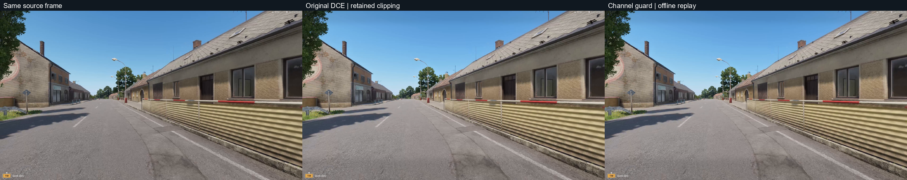
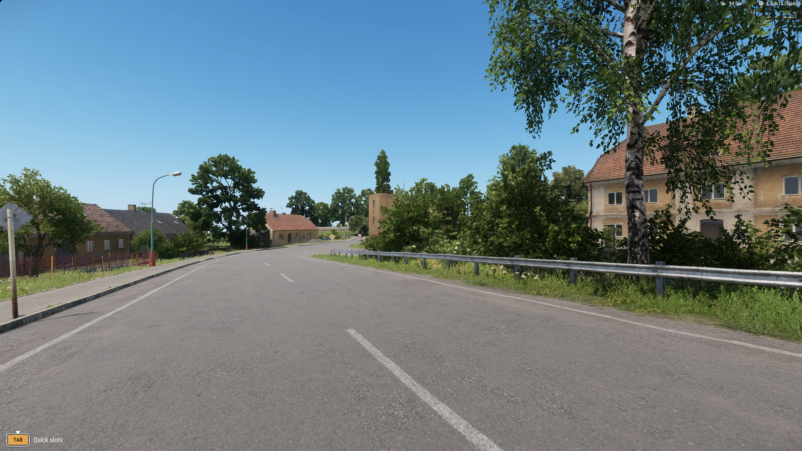
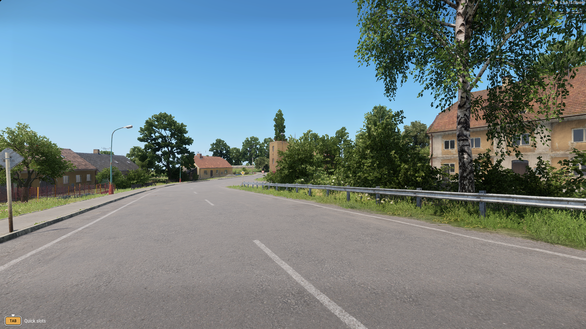

# Playable prototype

Updated 10 September 2026. **The live pipeline works; the requested photorealistic appearance is unfinished.** An isolated addon starts local single-player Reforger, and a Windows companion runs a pretrained exposure network over its actual 2560 × 1440 RGB frames on the RX 7800 XT.

## Run the build

[Download the Windows research build](downloads/playable-pipeline-2026-09-10.zip). Extract the entire folder, close any existing Reforger session and double-click **Start-Playable.cmd**. This PC needs its Steam game installation and Python 3 launcher. No PyTorch, CUDA or pip installation is needed to play.

- **F8:** expose the original game / resume the overlay.
- **F9:** switch identity / neural enhancement inside the companion.
- **F10:** quit the companion; the original game stays open.

The default starts free play in the town with standard settings. Optional: `Start-Playable.cmd --preset combined --scene town-evening --strength 0.35`. Scene choices are town, town-evening and foliage. Free play has no automatic movement. Use `--viewer` for a separate ordinary window.

Each launch writes an isolated addon, copied settings and logs into a new `runs/play-...` folder. The Steam installation and original profile are unchanged. The package includes source, hashes and separate model attribution. [Build from source](getting-started.md).

**Input limit:** engine actions verify a walking soldier and camera turn while enhancement is visible. Physical WASD/mouse routing through the overlay still awaits a user check. Use F8 or F10 if controls fail.

## Normal-speed gameplay

### Three minutes of repeated movement

The latest accepted comparison follows the same street out and back four times, with gradual turns. Each 180-second measurement contains **156 seconds of movement** and approximately **590–591 metres** of travel. With camera logging at 10 Hz, all three passes meet the declared route limits: maximum deviation **0.78 metres / 1.46°**. The game remains in the foreground throughout each final pass.

<figure class="motion-comparison">
<video controls playsinline preload="metadata" poster="media/playable-sustained-poster.png" width="2304" height="464" aria-label="Three-minute sustained gameplay comparison at original speed"><source src="media/playable-sustained-unretimed.mp4" type="video/mp4"><a href="media/playable-sustained-unretimed.mp4">Download sustained gameplay</a></video>
<figcaption>Standard / reduced / reduced + neural · all 184 seconds at 1× speed, including lead-in and tail</figcaption>
</figure>

| Configuration | Application presents/s | Frame interval p50 / p95 / p99, ms | Maximum, ms | Intervals >33.3 ms |
| --- | ---: | ---: | ---: | ---: |
| Standard game | 69.99 | 14.30 / 17.58 / 19.55 | 39.42 | 4 |
| Reduced game | 85.72 | 11.57 / 15.23 / 16.97 | 34.23 | 1 |
| Reduced game with enhancement | 72.03 | 13.84 / 18.94 / 22.16 | 47.07 | 18 |
| Enhancement companion | 60.21 | 15.54 / 30.57 / 32.74 | 49.22 | 85 |

These figures include native 1440p recording and 10 Hz camera logging. There are no intervals over 50 ms in the final measurement windows. They count application Present calls, including frames that may not reach the display; 10,961 internal capture records are excluded from the companion count. They do not establish locked 60 FPS. The earlier unrecorded setting-cost measurements remain below.

GPU copy, network and draw take **3.53 ms median / 6.28 ms p95**. Capture-to-Present age is **6.58 / 14.14 ms**, with the negative minimum of −3.37 ms retained as clock skew. Neither is physical input or display latency. The companion discards 122 queued source frames in favor of newer ones. Across its complete 198-second session it processes 11,925 frames with no recorded hide, bypass or presentation timeout.

The web movie scales each native source to 768 × 432 and holds the last available frame when an input is slower. It preserves elapsed speed and all stalls. Native 2560 × 1440 recordings remain local. Inspect the native-size [standard](media/sustained-standard-020.png), [reduced](media/sustained-reduced-020.png) and [enhanced](media/sustained-neural-020.png) views; these are separate route repeats, not pixel-aligned pairs.

Review covers **552 chronological one-second samples and 24 full-size keys**. The same buildings, openings, barriers, poles and vegetation remain recognizable. Enhancement mainly lifts midtones; reduced-render aliasing and peripheral movement blur remain visible. Brightening tapers toward protected screen margins. There is no accepted photorealistic material/lighting gain. Contact samples cannot establish frame-to-frame flicker, hidden-target visibility or complete temporal stability; continuous 1× perceptual review has not been completed.

The enhanced recording contains 10,010 frames over 184 seconds, approximately **54.40 recorded frames/s**; standard/reduced contain 11,034 / 11,036. Capture does not record every companion Present. Original timestamp gaps are retained: maximum 66.67 / 50 / 50 ms, including the lead-in. These recording intervals are separate from the application measurements above.

Measurement corrections and retained failures

The initial two passes meet the spatial gate but fail the direction gate at 7.88°. Those directions were interpolated from one-second logs. Decimating one denser recorded path to roughly that rate alone produces up to 14.43° of interpolation error at a turn boundary. One measurement amendment increases logging to 10 Hz while retaining the route, every threshold and the original time limit. The corrected final direction difference is 1.46° or less; the original failed result remains recorded.

The first enhanced attempt processes zero frames, and recording fails because its output window is absent. A later Windows inspection finds an old crash reporter over the game. Closing that local dialog and restoring game focus is consistent with recovery from the companion's inactivity guard, but the initial run did not log foreground ownership, so its cause is not conclusively isolated. No crash report is submitted. The standard pass interrupted during that recovery is excluded from the controlled comparison and retained. Selection is based on intervention, not speed.

The benchmark now logs foreground ownership, checks game focus before measurement and requires companion frame evidence before enhanced recording. The final runs pass those controls. Gameplay measurements finish within the original hour; review and evidence preparation close at 66.0 minutes, exceeding the bound. No further trials extend this experiment. They use the current diagnostic companion with display-statistics probes disabled; model, shader and controls are unchanged, and the earlier independently verified download is not rebuilt here. [Complete sustained evidence](https://github.com/ethan03805/enfusion-neural/blob/main/evidence/playable-sustained-v2.json) retains both validated addons, all measured attempts, logs, hashes, timestamps and review limits.

Reproduce the route using `scripts/setup_sustained.py --telemetry-hz 10 --plan scenes/playable-sustained-v2.json`, with a new `--out` and the installed `--lab-source`. Validate through Enfusion Lab, then pass that successful run to `scripts/benchmark_playable.py --sustained-validation RUN --sustained-seconds 180 --sustained-plan scenes/playable-sustained-v2.json --scene foliage-walk --trace cpu --record`, selecting each preset/mode. `scripts/analyze_sustained.py` applies the fixed gates. Original captures, profiles and model files remain research dependencies.

Earlier 34-second town and street recordings

Three independent town runs follow the same declared path: 20 seconds walking, then a 10-second heading sweep. Each complete recording lasts 34 seconds, including lead-in and tail. There is no speed change, optical flow or generated motion. Each native 1440p input is scaled to a 1280 × 720 panel for the web comparison; audio was not captured.

<figure class="motion-comparison">
<video controls playsinline preload="none" poster="media/playable-town-poster.png" width="3840" height="760" aria-label="Normal-speed town gameplay, standard, reduced and reduced plus neural"><source src="media/playable-town-unretimed.mp4" type="video/mp4"><a href="media/playable-town-unretimed.mp4">Download town gameplay</a></video>
<figcaption>Town · standard / reduced / reduced + neural · 34 seconds at 1× speed</figcaption>
</figure>

<figure class="motion-comparison">
<video controls playsinline preload="none" poster="media/playable-street-poster.png" width="3840" height="760" aria-label="Normal-speed tree-lined street gameplay, standard, reduced and reduced plus neural"><source src="media/playable-street-unretimed.mp4" type="video/mp4"><a href="media/playable-street-unretimed.mp4">Download tree-lined street gameplay</a></video>
<figcaption>Tree-lined street · standard / reduced / reduced + neural · 34 seconds at 1× speed</figcaption>
</figure>

The second accepted route travels **73.9–74.2 metres** along a Saint-Philippe street. All three passes clear the declared 50-metre displacement and 1 m/s minimum interior-speed gates. Sampled camera positions stay within **0.47 metres of the standard pass**, below the predeclared 0.5-metre limit. This adds tree canopies, trunks, poles, guardrails and building openings; it does not establish dense-forest coverage. The standard pass has a visible 283 ms recording gap near 9.7 seconds, retained at its original duration.

Retained failed foliage/fence comparison

<figure class="motion-comparison">
<video controls playsinline preload="none" poster="media/playable-foliage-poster.png" width="3840" height="760" aria-label="Normal-speed foliage gameplay, standard, reduced and reduced plus neural"><source src="media/playable-foliage-unretimed.mp4" type="video/mp4"><a href="media/playable-foliage-unretimed.mp4">Download foliage gameplay</a></video>
<figcaption>Foliage/fence collision check · standard / reduced / reduced + neural · 34 seconds at 1× speed</figcaption>
</figure>

The original foliage attempt reaches a solid fence and stops. The reduced-only run takes a different line around a tree, with a maximum sampled camera deviation of 1.87 metres. It is not an accepted matched moving-foliage benchmark; much of the timing window is stationary. A later east-facing pilot also hits a fence after only 9.26 metres. Two overhead surveys identified the adjacent passable street shown above.

Capture starts near simulation second 28 in each run. Initialization and head movement differ, so these are repeat paths, not pixel-aligned images. The town recordings' sampled camera positions differ by at most 0.21 metres at the same simulation times. The compositor holds the last available frame of a slower input, preserving elapsed time. Native VFR clips and timestamps remain local.

## Paired-frame exposure stability

A ten-second offline replay processes **all 600 source frames** through the original D3D11 network and compositor. Source and enhancement share exactly the same input frame, so this diagnostic measures the enhancement's added exposure variation without differences between gameplay repeats. The coarse check passes on both the selection segment and the reserved final three seconds. **It also finds a channel-clipping defect.** The correction below follows this retained original measurement; the downloadable package still uses the original shader pending live validation.

| Segment | Consecutive pairs | Median valid coverage | p95 of frame median change | p95 of frame p95 change |
| --- | ---: | ---: | ---: | ---: |
| First seven seconds | 419 | 84.90% | 0.075 codes | 0.798 codes |
| Reserved final three seconds | 180 | 83.79% | 0.071 codes | 0.763 codes |
| Frozen coarse limits | — | ≥60% | ≤1 code | ≤4 codes |

Changes are RGB8 luminance codes in the enhancement-minus-source residual, after source-only optical-flow correspondence at 448 × 252. Coverage refers to the declared central screen region after HUD, occlusion, gradient and photometric exclusions, **not the whole image**. Identity gives exactly zero change; deliberately alternating ±8-code brightness gives 16-code change and fails both limits. Small residual variation in these covered regions does not certify thin cover, openings, concealed targets, HUD transitions or complete perceptual stability.

Across 600 frames, **51,129 channel samples newly reach 0 or 255**, 0.000771% of all channel samples; every frame has at least one, with a maximum of 290. These are repeated channel observations, not distinct scene objects. The four fixed key frames show new white endpoints and no new black endpoints; the full-sequence count combines both endpoints. The original luminance guard does not prevent individual-channel saturation.

Paired video, reproduction and review limits

<figure class="motion-comparison">
<video controls playsinline preload="metadata" poster="media/dce-temporal-poster.png" width="1792" height="536" aria-label="Paired source and native exposure replay at original speed"><source src="media/dce-temporal-unretimed.mp4" type="video/mp4"><a href="media/dce-temporal-unretimed.mp4">Download paired exposure replay</a></video>
<figcaption>Same source frame / native DCE replay · 600 frames over 10 seconds at 1× speed · offline processing</figcaption>
</figure>

Each native 2560 × 1440 panel is area-reduced to 896 × 504, with labels above. All 600 encoded timestamps retain their original relative presentation times to numerical roundoff; no motion or speed change is introduced. This is an offline replay, not evidence of live processing at 60 FPS. Inspect the reserved native-size [source](media/dce-temporal-reserved-source.png) and [enhanced output](media/dce-temporal-reserved-enhanced.png).

The first CPU reproduction stops before temporal processing: curves differ from the retained native snapshot by at most 1.79 × 10⁻⁷, but composed RGB8 mean error is 0.033434 codes against the frozen 0.02 ceiling; maximum error is one code. The mostly positive composition bias has not been isolated. One documented alternative uses the exact native network and extracted companion shader on RX 7800 XT. It matches all 172,800 saved curve values and 11,059,200 output channels exactly, while retaining the independent CPU curve check. The original failure, snapshot, thresholds and deadline remain unchanged.

Review covers ten chronological one-second samples and all four native-size source/enhanced key pairs. Openings, roof patterns, poles, barriers and foliage keep their visible arrangement. Midtones lift slightly; source blur and aliasing remain. No substantial material or lighting improvement is accepted. Complete real-time perceptual review and all-frame visual inspection remain unfinished.

The experiment closes after **18.0 minutes**, within the original 30-minute bound. The offline helper includes CPU upload/readback and curve-file dumps; its timings are not live GPU cost or latency. `native/dce_replay.cpp` accepts RGB24 frames at 2560 × 1440: `enr_dce_replay weights.bin companion.hlsl NEW_CURVE_DIRECTORY`. The preparation, evaluation, review and publication scripts are retained as `scripts/*dce_temporal.py`; reproducing this historical evaluation also requires its local capture and pinned model files. [Complete paired-frame evidence](https://github.com/ethan03805/enfusion-neural/blob/main/evidence/playable-dce-temporal-v2.json) includes every per-frame result, both controls, source hashes, CPU failure and native amendment.

### Channel-preserving correction

The source build now limits positive exposure gain by the brightest source channel's remaining headroom. It keeps a shared RGB multiplier and the existing model, strength, masks and pixel coordinates. **All 600 guarded frames have zero newly clipped channels**, and every protected pixel remains identical to source. The downloadable ZIP awaits separate live validation of this change.

| Fixed check | Original compositor | With channel guard |
| --- | ---: | ---: |
| New endpoint-clipped channel samples, 600-frame sequence | 51,129 | 0 |
| New endpoint-clipped channels, deliberate bright fixture | 1,511,657 | 0 |
| Reserved temporal: p95 of frame median / frame p95 change | 0.070907 / 0.762612 codes | 0.071045 / 0.762951 codes |
| Reserved median valid-region coverage | 83.79% | 83.79% |

Both temporal results pass the unchanged coarse limits; their coverage and visibility exclusions still apply. The original snapshot, all original output frames and all neural curves reproduce exactly. Zero and invalid curves return exact source. The guarded bright/dark fixtures agree with the independent CPU reference within one RGB8 code, with mean errors 0.00444 / 0.00677 codes. This does not resolve the earlier CPU composition discrepancy on the gameplay snapshot.

Review covers all four native source/original/guarded triplets, ten chronological contact samples and all six fixture pairs. The four gameplay keys change only **162–334 pixels** relative to the original enhancement. Their visible scene arrangement and modest exposure effect remain; source blur and aliasing persist. This corrects color preservation, without establishing photorealistic materials, full temporal acceptance or semantic visibility.

Inspect the channel correction and reproduce its checks

<figure>

<figcaption>Same source / original DCE / channel guard · offline reserved frame · 896 × 504 per panel</figcaption>
</figure>

Native-size [source](media/dce-temporal-reserved-source.png), [original enhancement](media/dce-temporal-reserved-enhanced.png) and [guarded output](media/dce-channel-guard-reserved.png) remain unchanged. For example, pixel (216, 157) changes from source RGB **(141, 204, 252)** to original **(148, 213, 255)**; the guard gives **(142, 205, 254)**. Coordinates are zero-based in the reserved native frame.

The saturation fixture repeats all 1,728 combinations of twelve fixed channel values, including 0, 1, 253, 254 and 255. Inspect its full-size [source palette](media/dce-channel-guard-fixture-source.png), [original bright output](media/dce-channel-guard-fixture-original.png) and [corrected bright output](media/dce-channel-guard-fixture-corrected.png). Constant curves −1, +1 and zero exercise both gain directions and identity; out-of-range, NaN and infinity exercise fallback. The dark pair is byte-identical, as are source/zero/invalid outputs. These numerical fixtures are original procedural images, not game assets or photographic targets.

The guard caps positive gain at a 254/255 channel ceiling before the existing feathered protection. This leaves a rounding margin below a new RGB8 white endpoint. Negative gain remains bounded; source code 1 does not round to black at the tested strength. The maximum source-channel change remains 15 RGB8 codes throughout the gameplay and fixtures.

The correction closes after **16.8 minutes**, within its original 30-minute bound, including retained preparation failures and review. The native build, 79 Python tests and 12 native malformed-record checks pass. Offline replay timings include upload/readback and curve dumps; they are not live performance or latency. No new gameplay or video is claimed here.

`scripts/prepare_dce_channel_guard.py` freezes the original shader, source files and fixture; `scripts/evaluate_dce_channel_guard.py` replays the original and corrected native pass and checks every frame. The review and publication scripts preserve original outputs and the selected media. Historical replay requires its retained local capture and pinned weights. [Complete correction evidence](https://github.com/ethan03805/enfusion-neural/blob/main/evidence/playable-dce-channel-guard-v1.json) records the plan, all per-frame checks, fixture CPU errors, exact source hashes and review limits.

## Application performance

The table uses a 30-second town path **without recording**. Output is 2560 × 1440. Every varied setting is checked through engine readback. Geometry, texture and vegetation settings retain the user's saved values. Standard uses native scale, FSR off and high local/distant shadows.

| Configuration | Game presents/s | Game interval p50 / p95 / p99, ms | Intervals >33.3 ms |
| --- | ---: | ---: | ---: |
| Standard | 87.96 | 11.35 / 13.43 / 14.45 | 0 |
| 75% scale + FSR1 | 97.15 | 10.12 / 13.04 / 15.68 | 3 |
| Medium local / low distant shadows | 88.18 | 11.32 / 13.51 / 14.59 | 0 |
| SSDO + SSR disabled | 97.55 | 10.19 / 12.44 / 13.45 | 0 |
| All three reductions | 104.75 | 9.37 / 12.16 / 14.62 | 2 |
| Reduced + neural | 88.13 | 11.29 / 15.97 / 18.31 | 0 |
| Standard + neural | 72.05 | 13.80 / 18.11 / 20.37 | 0 |

The combined reduction creates 19.1% more game presentation throughput in this town sample. Shadow reductions alone make little difference. Adding enhancement to the combined reduction brings game throughput close to standard; adding it to standard costs substantially more.

**Companion output, reduced + neural:** 60.69 presents/s; 15.55 / 30.43 / 32.05 ms p50 / p95 / p99 intervals. Twelve intervals exceed 33.3 ms; maximum 41.46 ms. Twenty queued source frames are discarded in favor of newer frames. GPU copy + inference + draw take 3.44 ms median, 6.11 ms p95 and 7.64 ms p99. This is not a locked-60 result.

These are application Present calls, including frames that may never be displayed. PresentMon CPU traces exclude null-swapchain WGC events that otherwise falsely double the companion count. Game and companion run concurrently; GPU dispatch time is not substituted for whole-application FPS. One pass per setting provides no confidence interval or general performance guarantee. Sampled town camera paths differ by at most 0.17 metres.

**Recording overhead:** the town clips measure 77.68 / 97.35 / 81.47 game presents/s for standard / reduced / reduced + neural. The companion produces 60.43 presents/s, while the recording retains 1,845 frames over 34 seconds (54.26 frames/s). WGC recording performs an explicit CPU readback and NV12 conversion before AMD hardware encoding. The normal companion path has no full-frame CPU readback.

[Complete measurement record](https://github.com/ethan03805/enfusion-neural/blob/main/evidence/playable-comparison-v1.json) contains frame quantiles, path telemetry, configuration readback and raw-artifact hashes.

Earlier street, evening and runtime checks

### Tree-lined street, with recording

These are the first complete standard, reduced and enhanced passes on the accepted route. A preceding street launch crashed during world loading, before the player or companion started; its logs and dump are retained, and its cause is unknown. An identical retry produced the standard pass below. No completed pass was replaced based on performance.

| Configuration | Game presents/s | Game p95 / p99, ms | Maximum game interval, ms |
| --- | ---: | ---: | ---: |
| Standard | 70.86 | 16.54 / 18.96 | 295.11 |
| Reduced | 84.87 | 14.56 / 16.26 | 32.97 |
| Reduced + neural | 69.48 | 19.06 / 22.98 | 36.64 |

The companion averages **60.00 presents/s**, with **30.66 / 32.90 ms p95 / p99**, a 50.26 ms maximum and sixteen intervals above 33.3 ms. GPU copy/network/draw take 3.56 ms median / 6.44 ms p95. Capture-to-Present-call age is 6.69 ms median / 14.14 ms p95; displayed-frame and physical latency remain unavailable. The 34-second neural recording contains 1,817 frames, averaging 53.44 frames/s. Recording adds the same readback/conversion/encoding costs described above.

The standard application's 295.11 ms stall occurs about 8.11 seconds into the measurement window; the recording retains its 283.33 ms timestamp gap at 9.667–9.950 seconds. Averages and quantiles include the stall. The neural appearance still provides only a small brightness lift; roof and leaf aliasing remain visible. Passing a movement gate does not establish temporal or visibility acceptance.

[Street route, complete measurements and retained failures](https://github.com/ethan03805/enfusion-neural/blob/main/evidence/playable-street-v1.json). Reproduce from the repository with `scripts/benchmark_playable.py --out NEW_DIRECTORY --scene foliage-walk --preset combined --mode neural --trace cpu --record`; use standard/off and combined/off for the other passes. The new automatic benchmark route is not a scene option in the earlier downloadable free-play package.

Earlier recorded fence and evening checks

| Recorded case | Game presents/s | Game p95 / p99, ms | Companion presents/s | Companion p95 / p99, ms |
| --- | ---: | ---: | ---: | ---: |
| Foliage/fence standard | 66.95 | 17.89 / 19.70 | — | — |
| Foliage/fence reduced | 81.14 | 15.76 / 17.06 | — | — |
| Foliage/fence reduced + neural | 69.91 | 18.99 / 22.09 | 60.10 | 30.55 / 32.54 |
| Evening town reduced + neural | 82.03 | 17.42 / 20.29 | 60.65 | 30.38 / 32.15 |

The evening check is a single enhancement run, with no evening baseline claim. The rebuilt package changes C++ runtime linkage and metadata only. Its unchanged network passes independent CPU curve parity; the separate full-composition discrepancy is recorded in the paired-frame check above.

### Ten-minute runtime check

A separate 600-second reduced + neural run completes without a crash, recorded hide or presentation timeout. It follows the existing 30–60 second walk/turn segment and then holds a stationary town camera. This checks sustained processing, not ten minutes of movement. No video was recorded; ordinary Codex/documentation work continued on the CPU.

| Application | Presents/s | Interval p95 / p99, ms | Maximum interval, ms | Intervals >33.3 / >50 ms |
| --- | ---: | ---: | ---: | ---: |
| Game | 89.28 | 15.56 / 18.19 | 39.72 | 3 / 0 |
| Companion | 61.09 | 29.74 / 31.87 | 52.90 | 133 / 1 |

The companion processes 36,654 frames over 600.007 seconds. Each minute contains 60.70–61.45 presents/s; none falls below 30. GPU copy/network/draw take 3.50 ms median and 6.19 ms p95. Capture-to-Present-call age is 6.60 ms median / 13.95 ms p95, with raw negative offsets retained. It discards 380 queued source frames in favor of newer ones. PresentMon and native cadence agree; 37,015 internal capture events are excluded from application throughput. These measurements do not establish displayed-frame cadence, physical latency, manual controls or semantic fidelity.

[Complete ten-minute and per-minute evidence](https://github.com/ethan03805/enfusion-neural/blob/main/evidence/playable-soak-v1.json). Reproduce with `scripts/benchmark_playable.py --out NEW_DIRECTORY --preset combined --mode neural --trace cpu --soak-seconds 600`; summarize with `scripts/summarize_soak.py RUN_DIRECTORY --evidence OUTPUT_JSON`.

## Latency and fallback

An earlier live HWND sample joins **895 displayed frames**: **12.61 ms median, 18.12 ms p95, 20.98 ms p99** from WGC compositor timestamp to PresentMon-reported display. This excludes mouse/keyboard sampling and physical panel response. It is a separate early scene sample using engine defaults.

In the moving town path, capture timestamp to the companion's Present call is **6.75 ms median / 14.20 ms p95**. Raw signed values include negative compositor offsets and remain in the evidence. Moving-path display/GPU traces are unavailable, including a display-only retry. The standard baseline's resolved GPU trace measures 11.22 ms median game GPU activity; missing channels elsewhere are not reported as zero. Full added physical latency remains unmeasured.

A bounded follow-up queried the companion's supported DXGI frame statistics during the street walk. Both probes returned zero display counters: **2,923 frames with polling and 2,919 with `DwmFlush`**. Successful API return codes did not provide usable timestamps. The flush variant added 2.83 ms median / 4.51 ms p95 query time and still produced no display measurement. This route is closed; optional diagnostic flags remain off by default, and the download is unchanged. [Probe evidence and raw-counter hashes](https://github.com/ethan03805/enfusion-neural/blob/main/evidence/playable-dxgi-statistics-v1.json) · [Microsoft's API conditions](https://learn.microsoft.com/en-us/windows/win32/api/dxgi/nf-dxgi-idxgiswapchain-getframestatistics).

F8 exposes the original game. An earlier retained test measured 1.38 ms from handling the hotkey to hiding the overlay, excluding keyboard sampling. Loss of focus, minimization, stale frames or a presentation timeout also exposes source. Invalid curves fall back to source pixels. Fixed HUD margins, near-black/highlight protection and bounded brightness reduce appearance risk; they are not a semantic reconstruction-failure detector.

The packaged launch test processes 3,770 frames, verifies both F9 modes, F8 bypass/resume and clean F10 exit. Its F8 handler-to-hide log measures 1.20 ms. The captured 1440p source/output pair changes at most 15 code values per channel. All 76 CPU tests and native network parity pass. [Package verification](https://github.com/ethan03805/enfusion-neural/blob/main/evidence/playable-package-v1.json).

## Appearance and pretrained selection

The [appearance candidate comparison](model-evaluation.md) now includes REGEN on RX 7800 XT DirectML and DeepLPF on CPU, with raw outputs and rejection evidence. The downloadable build still uses the verified exposure model below.

The available input is **display-referred RGB with HUD**, not depth, normals, motion or material buffers. The model cannot recover a verified scene-lighting representation from those absent inputs.

**Zero-DCE++** is the working native model: 10,561 parameters, 320 × 180 FP32 curve prediction and full-resolution bounded composition. Its output matches the independent author's checkpoint reference to a maximum error of 0.000000075 over 172,800 values. It preserves source pixel coordinates and chroma while limiting brightness change. The change is modest; some ground surfaces become flatter or brighter. No photorealistic material gain is accepted.

<section class="comparison" data-comparison aria-label="Same game frame before and after live neural enhancement">

<figure class="comparison-before"><figcaption>Source game</figcaption></figure>
<figure class="comparison-after"><figcaption>Live Zero-DCE++ · bounded</figcaption></figure>

<label class="comparison-control" hidden>Reveal source<input type="range" min="0" max="100" value="50" aria-label="Source image visible"><output>50% original</output></label>
</section>

This is the exact source/output frame pair from the early live loop, before the profile correction. [Source PNG](media/playable-source.png) · [Native output PNG](media/playable-neural.png).

Rejected models and their visible failures are consolidated on the [appearance evaluation page](model-evaluation.md). None has replaced the live exposure network.

[Zero-DCE++ author code and weights](https://github.com/Li-Chongyi/Zero-DCE_extension) have separate academic/noncommercial research terms. [Image-Adaptive-3DLUT](https://github.com/HuiZeng/Image-Adaptive-3DLUT) uses Apache-2.0 terms. Pinned revisions and hashes are retained. [HDRNet](https://github.com/google/hdrnet) and [DPIR](https://github.com/cszn/DPIR) were researched but not runtime-evaluated; conversion work is deferred.

[Poly Haven pavement](https://polyhaven.com/a/pavement_04) and [rural asphalt/lighting](https://polyhaven.com/a/rural_asphalt_road) are suitable CC0 appearance references. They are not aligned ground truth for Everon's roads, masonry, roofs or foliage, and have not been used to train this build.

## Boundaries and retained failures

Initial coverage is two passable town streets with buildings, openings, signs, guardrails and vegetation edges, four repeated out-and-back cycles, a failed foliage/fence route, an evening town check and a mostly stationary ten-minute runtime test. No game meshes or textures are replaced. The shader performs no spatial reconstruction and has no temporal history; that avoids generated geometry and history ghosting, but does not prove temporal or semantic fidelity. Dense forest, interiors, scopes, combat visibility, rain and HDR remain unaccepted. The new sustained route adds movement evidence with the sampled-review limits stated above.

The first profile clone was one directory too high; its 114.70 game presents/s result used engine defaults and is not the standard baseline. The corrected launcher writes beneath the nested profile mount and verifies settings. Interrupted early ETW sessions and event-loss runs remain failed. Layered-window presentation variants failed visibly; the normal HWND route is retained. A hard HUD exclusion produced a sky seam and was replaced by a feathered boundary. Direct GPU recording submission failed; the working recorder's CPU conversion is explicit.

These investigations are closed for this iteration. The working code, original outputs and failures remain available. The next acceptance gates are physical input, moving-path display latency, broader visibility/stability checks and a demonstrably better appearance model. [Current status](status.md) · [Roadmap](roadmap.md).

[Microsoft WGC](https://learn.microsoft.com/en-us/windows/apps/develop/media-authoring-processing/screen-capture) · [Win32 capture sample](https://github.com/microsoft/Windows.UI.Composition-Win32-Samples/tree/master/cpp/ScreenCaptureforHWND) · [PresentMon](https://github.com/GameTechDev/PresentMon) · [Reforger startup parameters](https://community.bistudio.com/wiki/Arma_Reforger:Startup_Parameters).
