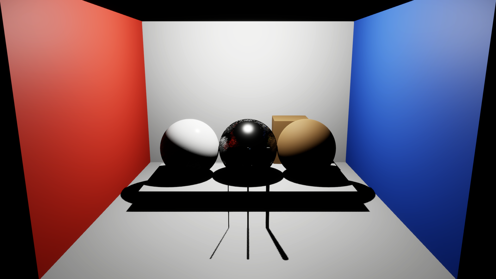
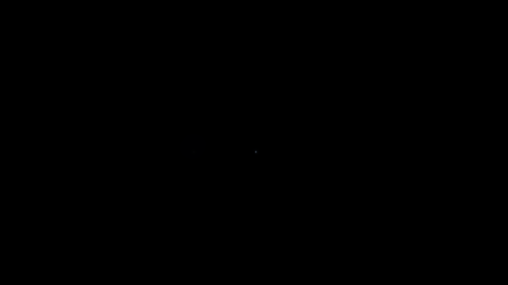
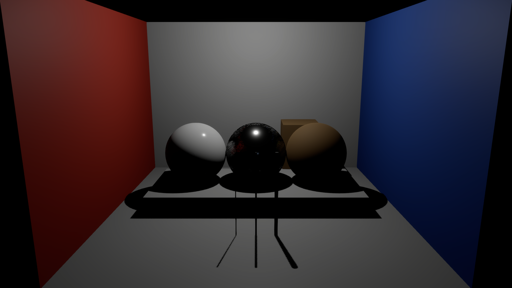

# Room lighting

A scripted point light illuminates the imported [material room](material-room.md). Six unchanged 2560 × 1440 captures retain the disabled light, two intensity settings, three independent repeats at the higher setting, and a clipping follow-up. These are engine controls; no model processes the images.

## Light response

The first plan fixes the packed materials, camera, exposure and midnight environment. Only the light's enabled state and requested native intensity change. The higher setting illuminates the room; the lower setting leaves all three declared measurement regions black.

<section class="comparison" data-comparison data-before-label="Light off" data-after-label="LV 12" aria-label="Enfusion point light response">

<figure class="comparison-before"><figcaption>Light off</figcaption></figure>
<figure class="comparison-after"><figcaption>LV 12</figcaption></figure>

<label class="comparison-control" hidden>Reveal disabled light<input type="range" min="0" max="100" value="50" aria-label="Disabled light visible"><output>50% Light off</output></label>
</section>

| Case | Mean neutral back-wall RGB8 |
| --- | ---: |
| Disabled, requested LV 10 | 0.00 |
| Enabled, LV 10 | 0.00 |
| Enabled, LV 12 | 221.65 |
| Enabled, LV 10 with clipping bias −10 | 102.15 |

The region is `[850, 260, 1700, 520]` in exported pixels. Values measure display response, not radiance or fidelity. Native LV has not been calibrated to physical light units, and no exact brightness ratio is assumed. The disabled and lower-setting images contain a faint spot outside the measured regions; neither is an exactly black frame.

## Clipping control

Bohemia documents a negative `SetIntensityEVClip` bias as making low-intensity clipping less strict. A separately declared follow-up changes only this requested bias to −10 at LV 10. The room becomes visible at the same camera exposure. This supports the clipping hypothesis; it does not calibrate light output. [LightEntity API](https://community.bistudio.com/wikidata/external-data/arma-reforger/EnfusionScriptAPIPublic/interfaceLightEntity.html)

<section class="comparison" data-comparison data-before-label="Default clip" data-after-label="Bias −10" aria-label="Enfusion low light clipping control">

<figure class="comparison-before"><figcaption>Default clip</figcaption></figure>
<figure class="comparison-after"><figcaption>Bias −10</figcaption></figure>

<label class="comparison-control" hidden>Reveal default clipping<input type="range" min="0" max="100" value="50" aria-label="Default clipping visible"><output>50% Default clip</output></label>
</section>

The original five-run plan remains unchanged. The follow-up was chosen after observing the lower-setting failure, and has its own plan and acceptance threshold. Both observations remain published.

## Repeats and remaining differences

All three independent LV 12 captures retain the same visible appearance. Across all three pairs, whole-image RGB8 MAE ranges from **0.00000018 to 0.00000280**, with a maximum channel difference of **3**. None is exactly RGB-identical. These static captures do not test motion stability.

[First capture](media/material-room-light-high.png) · [Repeat 2](media/material-room-light-high-repeat2.png) · [Repeat 3](media/material-room-light-high-repeat3.png)

Native readback verifies the enabled state, shadow flag, near plane and position. The disabled light reports radius **−15** for a requested **+15**; this raw mismatch is retained. Intensity, color, attenuation and clipping bias are recorded requests without getter verification.

Hard black shadows, dark lower sphere halves and coarse reflection edges remain visible. Night sky and environment probes have not been disabled. This point light also differs from the original Cycles square area light, so these captures are not an aligned appearance-training pair.

## Reproduce and continue

Use the verified original import and packed texture build described in [material room](material-room.md). Add `--light-case night-off`, `night-low` or `night-high` to `scripts/capture_enfusion_material_room.py`, together with `--texture-case packed`. Run off, low and three high captures serially in separate new output directories. For the follow-up, add `--light-clip-control` to a new `night-low` capture. Inspect every full-size sample before supplying the visual review to `scripts/summarize_enfusion_room_lights.py`.

[Initial plan](https://github.com/ethan03805/enfusion-neural/blob/main/scenes/material-room-light-control-v1.json) · [Follow-up plan](https://github.com/ethan03805/enfusion-neural/blob/main/scenes/material-room-light-clip-control-v1.json) · [Run hashes and measurements](https://github.com/ethan03805/enfusion-neural/blob/main/evidence/enfusion-room-lights-v1.json) · [Visual review](https://github.com/ethan03805/enfusion-neural/blob/main/evidence/enfusion-room-lights-review-v1.json)

Next, use a declared clipping policy for an intensity sweep at fixed exposure. Create a separately versioned point-light reference, calibrate brightness and color on independent patches, and quantify remaining material and environment differences. Keep the original area-light fixture and locked models unchanged. Supported scene inputs and output presentation remain a separate integration requirement.
